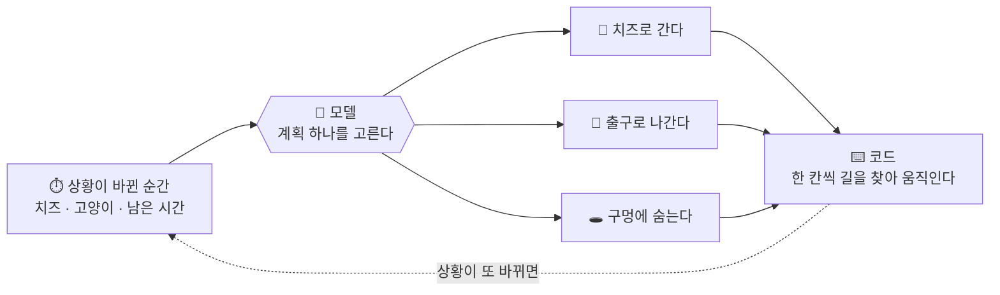

*이 블로그는 에이전트가 자료 대조와 실험을 거쳐 초안을 작성하고, 필자의 검수를 거쳐 게재됩니다.*

:::message
- 고양이를 피해 치즈를 모으는 게임을 **판단 모델**과 **대형 LLM**에 똑같이 시켜 봤습니다
- 시간이 흐르는 실시간 조건에서는 **오래 생각할수록 손해**였습니다
- 점수를 가장 크게 끌어올린 것은 모델 교체가 아니라 **질문을 어떻게 쪼개 주느냐**였습니다
:::

지난 편들에서 **판단 모델**을 몇 가지 각도로 봤습니다. [분류 과제](https://zenn.dev/nhandsome/articles/jev-vs-lightweight-llm-classification)에서는 라벨 단어 하나가 모델 교체보다 정확도를 더 끌어올렸고, [회의 아젠다](https://zenn.dev/nhandsome/articles/realtime-meeting-agenda-with-jev)에서는 싸고 빠른 판단이 실시간에 맞는다는 걸 확인했습니다.

> **판단 모델**(Decision Model 또는 System One Model)은 긴 문장을 생성하는 대신, 입력된 데이터에 대해 **미리 정해진 선택지나 확률값만 빠르게 출력하는** 인공지능 모델입니다.

이번에는 게임을 하나 만들어, **판단 모델과 대형 LLM에게 똑같은 과제를 시켜 봤습니다.**


---

## 치즈 미로 게임 — 모델이 하는 일은 「계획 고르기」뿐

9×9 미로에서 쥐가 치즈를 모아 출구로 나옵니다. **들고 나온 치즈 개수가 그 판의 점수**이고, 고양이에게 잡히거나 40턴을 넘기면 0점입니다. 아래 표의 「평균 점수」는 모두 **한 판에 들고 나온 치즈 개수의 평균**입니다.


여기서 **모델이 맡는 일은 하나뿐입니다.** 한 칸씩 길을 찾는 것은 코드가 하고, 모델은 **지금 어느 계획을 택할지**만 고릅니다. 그리고 상황이 바뀔 때마다 다시 묻습니다.



### 쥐는 세 마리입니다

| 쥐 | 모델 | 입력 |
|---|---|---|
| **빠른 쥐** | [Solar Decide](https://console.upstage.ai/docs/models/solar-decide) | 상황 문장을 주고 모델이 액션을 판단 |
| **생각하는 쥐** | Claude Sonnet | 상황 문장을 주고 모델이 액션을 판단 |
| **도움받는 쥐** | Solar Decide | 상황을 잘게 쪼개 여러 번 판단하고, 필요한 단순 계산은 코드로 |

Solar Decide는 리즈닝을 켤 수 있지만 **이번에는 끈 채로 썼습니다.** 빠른 쥐와 도움받는 쥐 모두 같은 조건입니다.

그래서 비교가 두 갈래로 나뉩니다.

- **빠른 쥐 ↔ 생각하는 쥐** — 입력은 같고, **모델만** 다르다
- **빠른 쥐 ↔ 도움받는 쥐** — 모델은 같고, **입력만** 다르다

### 두 가지 방식으로 돌렸습니다

**턴제**에서는 모델이 답할 때까지 게임이 멈춰 기다립니다. 몇 초를 생각하든 결과는 달라지지 않습니다.

**실시간**에서는 1초에 한 칸씩 시간이 흐릅니다. 모델이 생각하는 동안에도 **쥐는 이전 계획대로 걷고 고양이도 움직입니다.**

## 턴제 — 시간이 넉넉하면 큰 모델이 앞선다


| | 판 | 평균 점수 | 최적 선택률 | 판단 시간 |
|---|---|---|---|---|
| 빠른 쥐 (Solar Decide) | 50 | 0.98 | 27% | 0.48초 |
| 생각하는 쥐 (Sonnet) | 10 | **1.90** | **85%** | 7.0초 |

예상대로입니다. 같은 문장을 주고 생각할 시간을 넉넉히 주면 큰 모델이 앞섭니다.

빠른 쥐는 대부분 치즈를 거의 줍지 않고 곧장 출구로 갑니다(50판 중 40판이 탈출, 평균 1점 미만). 생각하는 쥐는 위험과 남은 시간을 따져 치즈를 더 모읍니다.

표의 **최적 선택률**은 코드가 계산한 기대 점수가 가장 높은 계획을 골랐는지를 센 값입니다. 그 기대 점수를 코드가 간단한 식으로 구하기 때문에, **「정답률」이라고는 부르지 않았습니다.**

## 실시간 — 생각하는 사이에 게임이 끝난다


**생각하는 쥐의 평균 점수가 1.90에서 1.00으로 떨어집니다.**

| | 평균 점수 | 판단 시간 | 생각하는 동안 걸은 칸/판 | 판단 횟수/판 |
|---|---|---|---|---|
| 빠른 쥐 (Solar Decide) | 0.96 | 0.52초 | 0.1 | 8.3 |
| 생각하는 쥐 (Sonnet) | **1.00** | 약 10초 | **27.7** | **3.2** |

40턴짜리 게임에서 **한 판에 27.7칸을 생각하는 동안 흘려보냈습니다.** 그만큼 묻는 횟수도 줄어, 턴제에서는 한 판에 11.4번 묻던 것이 실시간에서는 **3.2번**에 그쳤습니다.

> Sonnet의 판단 시간은 Claude Code 안의 **서브에이전트로 실행해 잰 값**입니다. 문제를 보여준 순간부터 답을 받은 순간까지라 **도구 왕복 시간이 포함돼 있고, Anthropic API 자체의 지연이 아닙니다.** API로 직접 부르면 더 빠를 수 있습니다. 이 글의 실시간 결과는 이 시간을 전제로 한 것입니다.

반면 빠른 쥐는 0.98에서 0.96으로 거의 그대로입니다. **시간에 쫓기지는 않습니다.** 다만 성적도 턴제 때와 다를 게 없습니다. 치즈 하나를 집고 서둘러 빠져나가기 바쁩니다.

## 입력을 쪼개서, 같은 모델에 다시 물었다

**상황 문장 하나에 위험과 남은 시간과 점수가 전부 뒤엉켜 있었습니다.** 그걸 한 번의 선택으로 다 따지라고 요구한 셈입니다. 작은 모델에게는 벅찬 요구일지도 모릅니다.

[지난 편](https://zenn.dev/nhandsome/articles/jev-vs-lightweight-llm-classification#jev%E3%81%8C%E5%85%A5%E3%82%8B%E5%A0%B4%E6%89%80)에서도 적었듯, Jev 같은 판단 모델은 **쓰임을 설계하는 일이 중요**하고, 입력도 **판단에 필요한 형태로 구조화**되어 있는 편이 모델에게 더 읽기 좋습니다.

그래서 **모델은 그대로 두고 질문만 쪼갰습니다.**

**① 쉬운 판단으로 나눠서 모델에게**

계획마다 두 가지만 따로 묻습니다.

```text
치즈 B를 먹으러 가는 계획의 위험 레벨을 고른다.
고양이는 순찰 중이고 쥐를 못 봤다. 이 계획의 경로에서 고양이와
가장 가까워지는 거리는 4칸이다.
  → 0 안전 / 1 약간 위험 / 2 위험 / 3 매우 위험

치즈 B를 먹으러 가는 계획은 총 5턴이 필요하다. 남은 턴은 35턴이다.
이 계획은 남은 턴 안에 가능한가?  → 예 / 아니오
```

위험이 어느 정도인지, 시간 안에 되는지. 둘 다 **판단 모델이 잘하는 단순 분류**입니다.

**② 필요한 단순 계산은 코드로**

모델의 답을 받아 코드가 기대 점수를 계산합니다.

> 기대 점수 = (1 − 잡힐 확률) × 점수

**③ 마지막 선택만 다시 모델에게**

계산한 기대 점수를 선택지에 붙여 다시 묻습니다.

```text
치즈 B를 먹으러 간다 — 기대 점수 1.7점
치즈 A를 먹으러 간다 — 기대 점수 1.3점
지금 출구로 나간다   — 기대 점수 0.9점
```


| | 평균 점수 | 최적 선택률 | 판단 시간 |
|---|---|---|---|
| 빠른 쥐 (Solar Decide) | 0.96 | 27% | 0.52초 |
| **도움받는 쥐 (Solar Decide + 입력 설계)** | **2.28** | **84%** | 1.23초 |
| 생각하는 쥐 (Sonnet) | 1.00 | 84% | 약 10초 |

세 줄이 모두 바뀌었습니다.

- **최적 선택률 27% → 84%** — 생각하는 쥐와 같은 수치입니다
- **평균 점수 0.96 → 2.28** — 세 마리 중 가장 높습니다
- **판단 시간 1.2초** — 1초에 한 칸 흐르는 게임을 따라갈 수 있습니다

**모델은 그대로입니다.** 바뀐 것은 질문을 어떻게 나눠 던졌는가뿐입니다.

## 세 마리를 한 표로

| | 턴제 | 실시간 | 최적 선택률 | 판단 시간 | 한 줄 특징 |
|---|---|---|---|---|---|
| 빠른 쥐 (Solar Decide) | 0.98 | 0.96 | 27% | 0.5초 | 빠르지만 얽힌 조건을 한꺼번에 못 따진다 |
| 생각하는 쥐 (Sonnet) | **1.90** | 1.00 | 85% | 7~10초 | 잘 따지지만 그동안 상황이 바뀐다 |
| 도움받는 쥐 (Solar Decide + 입력 설계) | **2.04** | **2.28** | 84% | 1.2초 | 턴제·실시간 모두 가장 높다 |

큰 모델은 잘 따지지만 그 시간을 감당할 수 있을 때만 앞섭니다. 판단 모델은 빠르지만 통째로 던진 문제는 버거워합니다. **같은 판단 모델에 입력만 다시 설계하니 두 쪽의 약점이 모두 빠졌습니다.**

## 판단 모델을 잘 쓰려면

판단 모델과 대형 LLM을 게임 하나로 나란히 돌려 봤습니다. 남은 것을 정리하면 이렇습니다.

**① 실시간 판단에서는 추론 시간이 그대로 손해가 됩니다.** 큰 모델은 잘 따지지만, 답을 기다리는 사이에 상황이 지나갑니다. 턴제에서 1.90이던 점수가 실시간에서 1.00이 됐습니다.

**② 상황을 통째로 던지면 판단 모델은 버거워합니다.** 위험과 남은 시간과 점수가 한 문장에 뒤엉킨 채로는 최적 선택률이 27%였습니다.

**③ 쪼개서 물으면 같은 모델이 84%까지 올라갑니다.** 모델에게는 「위험한가」「시간 안에 되는가」 같은 단순한 분류만 맡기고, 그 답을 모아 계산하는 일은 코드가 했습니다. **어려운 판단 하나를 쉬운 판단 여러 개로 나눈 것**입니다.

판단 모델은 **여러 질문을 서로 독립적으로 한 번에 던질 수 있고**, 그렇게 늘려도 속도에서 크게 손해 보지 않습니다. 이번에는 위험과 시간 두 가지만 물었는데, 물어볼 것을 더 나누고 더 붙여 가면 **판단 설계를 한층 더 다듬을 수 있지 않을까** 싶습니다.

:::message alert
**이 실험의 한계**

- 표본 수가 다릅니다 — Solar Decide 계열 50판, Sonnet 10판
- Sonnet의 판단 시간은 Claude Code 서브에이전트로 잰 값이라 도구 왕복이 포함돼 있습니다. **API 자체의 지연이 아닙니다**
- 「최적 선택률」의 기준이 되는 기대 점수는 코드가 간단한 식으로 구한 값입니다. **진짜 정답이 아니라 이 실험 안에서만 쓰는 기준**입니다
- 응답 형식 오류가 빠른 쥐 턴제 2회, 도움받는 쥐 각 방식 6회 있었고 그때는 규칙 봇이 대신 골랐습니다
:::

---

> 새 모델이 나오면 **얼마나 똑똑한지**부터 보게 됩니다. 그런데 이번 게임에서 점수를 끌어올린 건 모델이 아니라 **질문을 나눠 던진 쪽**이었습니다. 같은 모델에 같은 상황인데, 한 번에 다 묻느냐 쉬운 것 몇 개로 나눠 묻느냐로 27%와 84%가 갈렸습니다. 어떤 모델을 쓸지 고르는 것만큼이나, **그 모델에게 무엇을 어떻게 물을지 설계하는 일**에 품을 들여야겠다고 생각했습니다.

필자는 Upstage AI에서 TPM/SA를 맡고 있는 엔지니어입니다. 업스테이지는 Document AI·LLM·Agent를 조합해 문서의 정형화와 그 활용, 실제 업무로의 적용을 지원합니다. 관심 있으시면 [홈페이지](https://www.upstage.ai/jp)로 연락 주세요.
