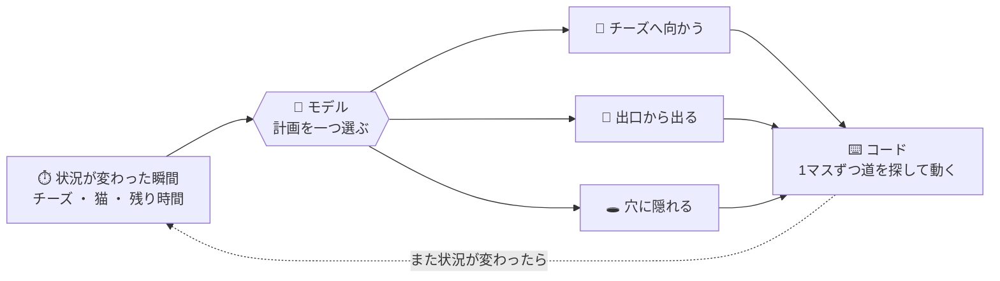

*このブログは、エージェントが資料の突き合わせと実験を行って下書きを作り、筆者が確認したうえで掲載しています。*

:::message
- 猫を避けてチーズを集めるゲームを、判断モデルと大規模LLMに同じ条件で解かせてみました
- 時間が流れるリアルタイム条件では、**長く考えるほど損**になりました
- スコアをいちばん押し上げたのはモデルの交換ではなく、**質問をどう分けて渡すか**でした
:::

前回までの記事で、判断モデルをいくつかの角度から見てきました。[分類タスク](https://zenn.dev/nhandsome/articles/jev-vs-lightweight-llm-classification)ではラベルの語ひとつがモデルの交換より正解率を押し上げ、[会議のアジェンダ](https://zenn.dev/nhandsome/articles/realtime-meeting-agenda-with-jev)では速くて安い判断がリアルタイムに向くことを確かめました。

> 判断モデル（Decision Model あるいは System One Model）は、長い文章を生成する代わりに、入力されたデータに対して**あらかじめ決められた選択肢や確率値だけを素早く出力する**AIモデルです。

今回はゲームを一つ作り、判断モデルと大規模LLMに**同じ課題**を解かせています。


---

## チーズ迷路ゲーム：モデルがやるのは「計画を選ぶ」ことだけ

9×9の迷路でネズミがチーズを集め、出口から出ます。**持ち出したチーズの数がその戦のスコア**で、猫に捕まるか40ターンを超えると0点です。以下の表の「平均スコア」はすべて、1戦で持ち出したチーズの数の平均です。


ここでモデルが受け持つ仕事は一つだけ。1マスずつ道を探すのはコードがやり、モデルは**いまどの計画を取るか**だけを選びます。そして状況が変わるたびに、また問います。



### ネズミは3匹です

| ネズミ | モデル | 入力 |
|---|---|---|
| **速いネズミ** | [Solar Decide](https://console.upstage.ai/docs/models/solar-decide) | 状況の文章を渡してモデルが行動を判断 |
| **考えるネズミ** | Claude Sonnet | 状況の文章を渡してモデルが行動を判断 |
| **手伝ってもらうネズミ** | Solar Decide | 状況を細かく分けて何度も判断し、必要な単純計算はコードで |

Solar Decide は推論を有効にできますが、今回は切った状態で使いました。速いネズミも手伝ってもらうネズミも同じ条件です。

そのため比較は二通りに分かれます。

- **速いネズミ ↔ 考えるネズミ** — 入力は同じで、**モデルだけ**が違う
- **速いネズミ ↔ 手伝ってもらうネズミ** — モデルは同じで、**入力だけ**が違う

### 二つの方式で回しました

**ターン制**では、モデルが答えるまでゲームが止まって待ちます。何秒考えても結果は変わりません。

**リアルタイム**では、1秒に1マスずつ時間が流れます。モデルが考えているあいだもネズミは前の計画のまま歩き、猫も動きます。

## ターン制：時間に余裕があれば大きなモデルが勝つ


| | 戦 | 平均スコア | 最適選択率 | 判断時間 |
|---|---|---|---|---|
| 速いネズミ (Solar Decide) | 50 | 0.98 | 27% | 0.48秒 |
| 考えるネズミ (Sonnet) | 10 | **1.90** | **85%** | 7.0秒 |

予想どおりです。同じ文章を渡し、考える時間をたっぷり与えれば大きなモデルが勝ちます。

速いネズミはチーズをほとんど拾わず、まっすぐ出口へ向かうことが多いです（50戦中40戦が脱出、平均1点未満）。考えるネズミは危険と残り時間を見比べて、チーズをもっと集めます。

表の最適選択率は、コードが計算した期待値がいちばん高い計画を選んだかを数えた値です。その期待値はコードが簡単な式で求めているので、「正解率」とは呼んでいません。

## リアルタイム：考えているあいだにゲームが終わる


**考えるネズミの平均スコアが1.90から1.00に落ちます。**

| | 平均スコア | 判断時間 | 考えているあいだに歩いたマス/戦 | 判断回数/戦 |
|---|---|---|---|---|
| 速いネズミ (Solar Decide) | 0.96 | 0.52秒 | 0.1 | 8.3 |
| 考えるネズミ (Sonnet) | **1.00** | 約10秒 | **27.7** | **3.2** |

40ターンのゲームで、1戦あたり**27.7マス**を考えているあいだに流してしまいました。そのぶん問う回数も減り、ターン制では1戦に11.4回問えていたものが、リアルタイムでは**3.2回**にとどまりました。

> Sonnet の判断時間は Claude Code 内のサブエージェントとして実行して測った値です。問題を見せた瞬間から答えを受け取る瞬間までなので、**ツールの往復時間が含まれており、Anthropic API 自体の遅延ではありません。** API を直接呼べばもっと速い可能性があります。この記事のリアルタイムの結果は、この時間を前提にしたものです。

一方で速いネズミは0.98から0.96とほぼそのままです。時間に追われることはありません。ただし成績もターン制のときと変わりません。チーズを一つ拾って足早に抜けるだけです。

## 入力を分けて、同じモデルにもう一度問う

状況の文章ひとつに、危険と残り時間とスコアがすべて絡まっていました。それを一度の選択ですべて見比べろと求めたわけです。小さなモデルには荷が重い要求かもしれません。

[前回の記事](https://zenn.dev/nhandsome/articles/jev-vs-lightweight-llm-classification#jev%E3%81%8C%E5%85%A5%E3%82%8B%E5%A0%B4%E6%89%80)でも書いたとおり、Jev のような判断モデルは使いどころを設計することが大事で、入力も**判断に必要な形に構造化**されているほうがモデルには読みやすくなります。

そこでモデルはそのままにして、質問だけを分けました。

**① やさしい判断に分けてモデルへ**

計画ごとに二つだけを別々に問います。

```text
チーズBを食べに行く計画の危険度を選ぶ。
猫は巡回中でネズミを見ていない。この計画の経路で猫といちばん近づく距離は4マスだ。
  → 0 安全 / 1 やや危険 / 2 危険 / 3 かなり危険

チーズBを食べに行く計画には合計5ターンかかる。残りは35ターンだ。
この計画は残りターン内に間に合うか？  → はい / いいえ
```

危険がどの程度か、時間内に間に合うか。どちらも判断モデルが得意な単純な分類です。

**② 必要な単純計算はコードで**

モデルの答えを受け取って、コードが期待値を計算します。

> 期待値 =（1 − 捕まる確率）× スコア

**③ 最後の選択だけ、もう一度モデルへ**

計算した期待値を選択肢に添えて、また問います。

```text
チーズBを食べに行く — 期待値 1.7点
チーズAを食べに行く — 期待値 1.3点
いま出口から出る    — 期待値 0.9点
```


| | 平均スコア | 最適選択率 | 判断時間 |
|---|---|---|---|
| 速いネズミ (Solar Decide) | 0.96 | 27% | 0.52秒 |
| **手伝ってもらうネズミ (Solar Decide + 入力の設計)** | **2.28** | **84%** | 1.23秒 |
| 考えるネズミ (Sonnet) | 1.00 | 84% | 約10秒 |

三つの数字がすべて変わりました。

- **最適選択率 27% → 84%** — 考えるネズミと同じ水準です
- **平均スコア 0.96 → 2.28** — 3匹でいちばん高い値です
- **判断時間 1.2秒** — 1秒に1マス流れるゲームについていけます

**モデルはそのままです。** 変えたのは、質問をどう分けて渡したかだけです。

## 3匹を一つの表に

| | ターン制 | リアルタイム | 最適選択率 | 判断時間 | ひとことで |
|---|---|---|---|---|---|
| 速いネズミ (Solar Decide) | 0.98 | 0.96 | 27% | 0.5秒 | 速いが、絡み合った条件をまとめて見比べられない |
| 考えるネズミ (Sonnet) | **1.90** | 1.00 | 85% | 7〜10秒 | よく見比べるが、そのあいだに状況が変わる |
| 手伝ってもらうネズミ (Solar Decide + 入力の設計) | **2.04** | **2.28** | 84% | 1.2秒 | ターン制もリアルタイムもいちばん高い |

大きなモデルはよく見比べますが、その時間を負担できるときだけ勝ちます。判断モデルは速いものの、丸ごと投げられた問題は手に余る。**同じ判断モデルに入力だけを設計し直したら、両方の弱点が抜けました。**

## 判断モデルをうまく使うには

判断モデルと大規模LLMを、ゲーム一つで並べて回してみました。残ったものを整理するとこうなります。

**① リアルタイムの判断では、推論時間がそのまま損になる。** 大きなモデルはよく見比べますが、答えを待つあいだに状況が過ぎていきます。ターン制で1.90だったスコアが、リアルタイムでは1.00でした。

**② 状況を丸ごと投げると、判断モデルは手に余る。** 危険と残り時間とスコアが一文に絡まったままでは、最適選択率は27%でした。

**③ 分けて問えば、同じモデルが84%まで上がる。** モデルには「危険か」「時間内に間に合うか」といった単純な分類だけを任せ、その答えをまとめて計算する仕事はコードがやりました。難しい判断ひとつを、やさしい判断いくつかに分けたわけです。

判断モデルは複数の質問を互いに独立させて一度に投げられ、そうやって増やしても速度で大きく損をしません。今回は危険と時間の二つしか問いませんでしたが、問うことをさらに分けて足していけば、**判断の設計をもう一段よくできるのではないか**と思っています。

:::message alert
**この実験の限界**

- 標本数が違います。Solar Decide 系は50戦、Sonnet は10戦です
- Sonnet の判断時間は Claude Code のサブエージェントで測った値で、ツールの往復が含まれています。API 自体の遅延ではありません
- 「最適選択率」の基準になる期待値は、コードが簡単な式で求めた値です。**本当の正解ではなく、この実験の中だけで使う基準**です
- 応答形式のエラーが速いネズミのターン制で2回、手伝ってもらうネズミで各方式6回あり、そのときはルールボットが代わりに選びました
:::

---

> 新しいモデルが出ると、どれだけ賢いかから見てしまいます。ところが今回のゲームでスコアを押し上げたのはモデルではなく、**質問を分けて投げたほう**でした。同じモデルで同じ状況なのに、一度にまとめて問うか、やさしいものいくつかに分けて問うかで27%と84%に分かれました。どのモデルを使うかを選ぶのと同じくらい、そのモデルに何をどう問うかを設計する仕事に手間をかけようと思いました。

筆者は Upstage AI で TPM/SA を担当しているエンジニアです。Upstage は Document AI・LLM・Agent を組み合わせ、文書の構造化とその活用、実業務への適用を支援しています。ご興味がありましたら、[ホームページ](https://www.upstage.ai/jp)からお問い合わせください。
