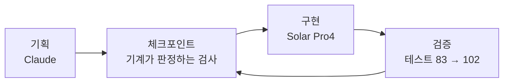

*이 블로그는 Solar Pro4가 에이전트의 활동 로그를 바탕으로 초안을 자동 작성하고, Claude와 필자의 검수를 거쳐 게재됩니다.*

:::message
**세 줄 요약**
- 한국어 한자어와 일본어 한자어를 **발음으로 잇는** 끝말잇기 게임을 만들었습니다
- 기획은 Claude, 구현은 Solar Pro4 — 기획서도 지시도 전부 일본어로 진행했습니다
- 실제 플레이 화면과, 잘한 것·못한 것을 정리한 평가까지 담았습니다
:::

한 번도 게임이란 걸 만들어 본 적이 없는 엔지니어입니다. 이번에 확인해 보고 싶었던 건 두 가지였어요. Solar Pro4의 **일본어 이해 능력**, 그리고 **게임 개발에 필요한 복잡한 수행 능력**을 감당할 수 있는지입니다. 그래서 만들어 본 게 이 한자음 끝말잇기 게임입니다.

---

## 발상 — 한자가 아니라 소리로 잇는다

한국어와 일본어에는 한자를 기반으로 한 단어가 많습니다. 여기서 착안한 건 한자의 **의미**가 아니라, **한자어의 발음 규칙이 두 언어에서 거의 대응한다**는 쪽이었습니다. 그러면 끝말잇기가 성립합니다.

규칙은 이렇습니다. 한국어 한자어 다음에는 그 **끝 한자의 일본 음독**으로 시작하는 일본어 한자어를, 일본어 한자어 다음에는 그 **끝 한자의 한국음**으로 시작하는 한국어 한자어를 잇습니다. 경계에서 언어가 바뀝니다.

실제로 게임에 쓰는 예시 체인입니다.

```text
學生(학생) → 生物(せいぶつ) → 物體(물체) → 體育(たいいく) → 陸上(육상) → 常識(じょうしき)
```

- 學生의 끝 한자 生 → 일본 음독 「せい」 → 生物(せいぶつ)
- 生物의 끝 한자 物 → 한국음 「물」 → 物體(물체)
- 物體의 끝 한자 體 → 일본 음독 「たい」 → 體育(たいいく)
- **體育의 끝 한자 育 → 한국음 「육」 → 陸上(육상)** ← 한자가 다른데 소리로 이어집니다
- **陸上의 끝 한자 上 → 일본 음독 「じょう」 → 常識(じょうしき)** ← 마찬가지입니다

이 체인은 제가 예시로 적어 본 것인데, 엔진이 한자가 아니라 **소리**로 판정하도록 설계돼 있어서 코드를 한 줄도 고치지 않고 그대로 성립했습니다.

:::details 왜 한자어만 허용했나
고유어를 섞으면 이을 수 없는 음절이 생겨 게임이 막힙니다. 한자어로 범위를 좁히면 두 언어를 같은 좌표계 위에 올릴 수 있고, 규칙에 예외를 두지 않아도 되니 구현도 깨끗해집니다.
:::

## 게임 형태 — 순서대로 줍는다

플레이어는 단어 카드를 하나 들고 시작합니다. 맵에 흩어진 카드를 **체인 순서대로** 주워 모으는 게 목표예요. 화살표 키 또는 WASD로 움직이고, 라이프는 3개입니다. 슬라임이 쏘는 총알에 맞거나 순서가 틀린 카드를 주우면 하나 깎입니다. 체인을 완성하면 다음 스테이지로 넘어갑니다.

## 기획 — 문서가 아니라 검사로

기획은 Claude에게 맡겼습니다. 나온 건 SPEC 문서와, 그보다 중요한 **실행 가능한 체크포인트**였습니다. "이 단계가 끝났다"를 사람이 읽고 판단하는 문장이 아니라 기계가 돌려서 통과·실패를 내는 검사로 바꿔 둔 것입니다. 그래야 구현을 맡은 쪽이 매 세션 문서 전체를 다시 읽지 않고도 혼자 굴러갑니다.



그리고 **기획서도 Solar에 대한 지시도 전부 일본어로 썼습니다.** Solar는 일본어 지시를 받아 한국어 산출물(코드 주석·문서)을 냈고요. 지시 언어는 일본어, 산출 언어는 한국어, 작업 도메인은 한자음 대응 — 3중 언어 작업인 셈입니다.

## 코드 — Solar Pro4가 맡은 것

| 담당 | 한 일 |
|---|---|
| 데이터 | 한자 300+자 · 단어 사전 구축 (전수 감사 후 464어) |
| 규칙 엔진 | 한글 음절 분해·조립, 두음법칙, 가나 모라 경계 판정 |
| 게임 | 상태기계·점수·스테이지 생성기·API |
| 화면 | 캔버스 렌더러, 스프라이트 엔진, 파티클 |
| 검증 | 테스트 83개 → 102개 (전부 통과 유지) |

작업량은 기록에 남은 수치로 이 정도입니다.

| 항목 | 값 |
|---|---|
| 1차 사이클 | 25세션 / 툴콜 1,209 / 세션당 툴콜 48.4 |
| 혼자 돌린 회차 | 12회(사람 개입 2회) · 야간 01:13~01:38 · 디자인 작업 15:01~15:29 |
| 커밋 | 30건 (Solar 7 · Claude 23) |

## 결과 — 실제 화면

말로 설명하는 것보다 움직이는 걸 보는 편이 빠를 것 같아 한 판을 녹화했습니다.


```text
시작    🃏 보유 단어 「학생」 · 진행줄 0/5 · 라이프 3
   │       좌상단 HUD가 다음에 필요한 소리를 알려준다 (日本語・しょう / せい)
   ▼
이동    🏃 화살표 키로 카드에 접근
   │       슬라임이 쏜 총알에 피격 — 라이프 3 → 2
   ▼
수집    📈 진행줄이 채워진다
   │       학생 → 生物 → 물체 → 体育 → 육상
   │       주울 때마다 우하단에 한자와 읽기가 뜬다
   ▼
남은 것  🎯 4/5 · 마지막 한 장은 常識
```

- **시작** — 손에 든 「학생」에서 출발합니다. 좌상단에 다음에 필요한 소리가 표시되니, 일본어를 몰라도 어떤 카드를 찾아야 하는지는 알 수 있습니다.
- **이동·피격** — 가장자리를 배회하는 슬라임이 총알을 쏩니다. 맞으면 라이프가 3에서 2로 줄어듭니다.
- **수집** — 순서대로 주울 때마다 상단 진행줄이 한 칸씩 채워지고, 우하단에 그 단어의 한자와 읽기가 뜹니다. 한국어 카드와 일본어 카드가 번갈아 들어옵니다.
- **남은 것** — 4/5까지 채운 상태입니다. 마지막 한 장인 常識을 주우면 체인이 완성되고 다음 스테이지로 넘어갑니다.

화면에서 「陸上」 다음에 「常識」이 붙는 대목이 이 게임의 정체입니다. 두 단어는 한자를 공유하지 않습니다. 上의 일본 음독 「じょう」와 常의 「じょう」가 같아서 이어지는 것이고, 그 판정이 화면 위에서 그대로 보입니다.

## Claude가 본 Solar Pro4

작업 기록을 근거로, Claude가 정리한 평가입니다.

**좋았던 점**

- **일본어 지시만으로 완주했습니다.** 이 구간의 지시는 전부 일본어였고, 커밋 메시지도 일본어로 남겼습니다.
- **기존 코드를 지키면서 개조했습니다.** 손대면 안 되는 자산(규칙 엔진·사전·이전 모드)을 건드리지 않고 화면만 전면 교체하면서 기존 테스트를 전부 살렸습니다. 백지에서 새로 만드는 것보다 어려운 쪽입니다.
- **추상적인 제약을 코드 구조로 옮깁니다.** "프레임 중에 픽셀을 그리지 말고 시작할 때 한 번 구워서 `drawImage`만 써라"는 성능 조항을 정확히 구현했습니다.
- **스펙 결함을 스스로 찾아 절차대로 보고했습니다.** 데이터와 SPEC 조건이 어긋나 판정이 전멸하는 문제를 자기가 발견하고, SPEC을 멋대로 고치는 대신 현상·원인·선택지·자기 판단을 적어 올렸습니다. 확인해 보니 진짜 결함이었습니다.
- **통과시키려고 억지를 부리지 않았습니다.** 제 실수로 헛돌게 된 세션에서 "고칠 것이 없다"를 확인하고 변경 없이 마감했습니다.

**부족했던 점**

- **형태를 만드는 일은 아직 사람 몫입니다.** 도트 도안을 시켜보니 16×16 규격과 팔레트는 지키는데 모양이 안 나옵니다. 하트가 하트로 보이지 않았어요.
- **긴 정형 데이터를 응답으로 고치려다 실패했습니다.** 규격 오류를 스스로 검사해 알아냈는데, 수정본을 응답에 직접 타이핑하다 출력 길이 제한에 걸려 끝내 고치지 못했습니다.
- **이음새는 놓칩니다.** 함수 단위 테스트는 전부 통과했는데 점수 배선이 반대로 연결돼 있었습니다. 단위는 스스로 지키지만 **통합 지점의 검증**은 위쪽 역할에 남습니다.

**고쳐서 넘어간 것**

- 긴 데이터는 응답에 쓰게 하지 않고 **스크립트로 파일을 고치도록** 지시문과 SPEC에 못박았습니다. 이후 재발하지 않았습니다.
- 도안은 사람이 그리고 **엔진은 Solar가 만드는** 분업으로 바꿨습니다. 팔레트 21색·스프라이트 15종을 넘겼더니 그걸 쓰는 스프라이트 엔진을 15분에 완성했습니다.
- 화면은 **렌더를 재현해서** 검증하기로 했습니다. 함수가 있는지 확인하는 걸로는 화면을 알 수 없어서, 타일 시퀀스를 그대로 뽑아 실제 좌표·실제 도안으로 PNG를 만들어 눈으로 봤습니다. 이 방법으로 결함 2건을 잡았습니다.

정리하면 이렇습니다. 기획이 정밀하고(모호성 제거 · 검증 가능한 완료 조건 · 실행 가능한 체크포인트) 피드백을 주고받을 통로가 있으면, Solar Pro4는 구현 전 과정을 일본어 지시만으로 자립 완주합니다. 사람 쪽에 남는 몫은 **형태를 만드는 일**과 **이음새를 보는 일**이었습니다.

## 고찰

한 번도 게임이란 걸 만들어본 적이 없는데, 놀라웠습니다. 더 수정할 게 많을 것 같지만, 이제부터는 Solar Pro4만으로도 수정·기획·운영이 가능할 것 같다는 생각이 듭니다.

이 글은 「나만의 에이전트 비서 만들기」에서 소개한 환경으로 **무엇을 만들었나**에 해당하는 이야기입니다. 도구를 소개한 앞선 글들과 달리, 이번에는 그 도구로 나온 결과물 쪽을 적었습니다.

---

> 규칙을 먼저 세워 두니 화면도 그 규칙 위에서 움직였습니다. 일본어 지시만으로 끝까지 구현되는 걸 보면서 생각보다 멀리 갈 수 있겠다 싶었고, 동시에 아직 사람 손이 필요한 자리가 어디인지도 같이 보였습니다.
