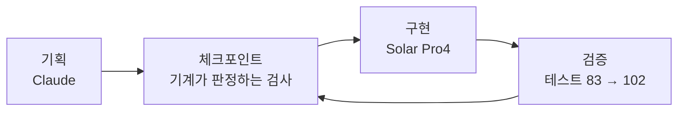

*이 블로그는 Solar Pro4가 에이전트의 활동 로그를 바탕으로 초안을 자동 작성하고, Claude와 필자의 검수를 거쳐 게재됩니다.*

:::message
**세 줄 요약**
- 한국어 한자어와 일본어 한자어를 **발음으로 잇는** 끝말잇기 게임을 만들었습니다
- 기획은 Claude, 구현은 Solar Pro4 — 기획서도 지시도 전부 일본어로 진행했습니다
- 실제 플레이 화면과, 잘한 것·못한 것을 정리한 평가까지 담았습니다
:::

저는 한 번도 게임이란 걸 만들어 본 적이 없는 엔지니어입니다. 확인해 보고 싶었던 건 두 가지였습니다. Solar Pro4의 일본어 이해 능력, 그리고 게임 개발에 필요한 복잡한 수행 능력입니다. 그래서 한자음 끝말잇기 게임을 만들었습니다.

---

## 발상 — 한자가 아니라 소리로 잇는다

한국어와 일본어에는 한자를 기반으로 한 단어가 많습니다. 여기서 착안한 건 한자의 의미가 아니라, 한자어 발음 규칙이 두 언어에서 거의 대응한다는 점이었습니다. 그러면 끝말잇기가 성립합니다.

규칙은 이렇습니다. 한국어 한자어 다음에는 그 끝 한자의 일본 음독으로 시작하는 일본어 한자어를, 일본어 한자어 다음에는 그 끝 한자의 한국음으로 시작하는 한국어 한자어를 잇습니다. 경계에서 언어가 바뀝니다.

```text
[한국어]  學生 (학생)
             └─ 生 ─→ 일본 음독 「せい」
[일본어]  生物 (せいぶつ)
             └─ 物 ─→ 한국음 「물」
[한국어]  物體 (물체)
             └─ 體 ─→ 일본 음독 「たい」
[일본어]  體育 (たいいく)
             └─ 育 ─→ 한국음 「육」
[한국어]  陸上 (육상)      ← 育과 陸은 다른 한자인데 소리가 같아 이어진다
             └─ 上 ─→ 일본 음독 「じょう」
[일본어]  常識 (じょうしき)
```

이 체인은 제가 예시로 적어 본 것인데, 엔진이 한자가 아니라 소리로 판정하도록 설계돼 있어서 코드를 한 줄도 고치지 않고 그대로 성립했습니다.

:::details 왜 한자어만 허용했나
고유어를 섞으면 이을 수 없는 음절이 생겨 게임이 막힙니다. 한자어로 범위를 좁히면 두 언어를 같은 좌표계 위에 올릴 수 있고, 규칙에 예외를 두지 않아도 되니 구현도 깨끗해집니다.
:::

## 게임 형태 — 순서대로 줍는다

플레이어는 단어 카드를 하나 들고 시작합니다. 맵에 흩어진 카드를 체인 순서대로 주워 모으는 게 목표예요.

화살표 키 또는 WASD로 움직이고, 라이프는 3개입니다. 슬라임이 쏘는 총알에 맞거나 순서가 틀린 카드를 주우면 하나 깎입니다. 체인을 완성하면 다음 스테이지로 넘어갑니다.

## 기획 — 문서가 아니라 검사로

기획은 Claude에게 맡겼습니다. 나온 건 SPEC 문서와, 그보다 중요한 실행 가능한 체크포인트였습니다. "이 단계가 끝났다"를 사람이 읽고 판단하는 문장이 아니라 기계가 돌려서 통과·실패를 내는 검사로 바꿔 둔 것입니다.

그래야 구현을 맡은 쪽이 매 세션 문서 전체를 다시 읽지 않고도 혼자 굴러갑니다.



기획서와 Solar에 대한 지시는 전부 일본어로 썼습니다. Solar는 일본어 지시를 받아 한국어 산출물(코드 주석·문서)을 냈습니다.

지시 언어는 일본어, 산출 언어는 한국어, 작업 도메인은 한자음 대응 — 3중 언어 작업입니다.

## 코드 — Solar Pro4가 맡은 것

데이터부터 화면까지 다섯 영역입니다.

| 담당 | 한 일 |
|---|---|
| 데이터 | 한자 300+자 · 단어 사전 구축 (전수 감사 후 464어) |
| 규칙 엔진 | 한글 음절 분해·조립, 두음법칙, 가나 모라 경계 판정 |
| 게임 | 상태기계·점수·스테이지 생성기·API |
| 화면 | 캔버스 렌더러, 스프라이트 엔진, 파티클 |
| 검증 | 테스트 83개 → 102개 (전부 통과 유지) |

작업량은 기록에 남은 수치로 이 정도입니다.

| 항목 | 값 |
|---|---|
| 1차 사이클 | 25세션 / 툴콜 1,209 / 세션당 툴콜 48.4 |
| 혼자 돌린 회차 | 12회(사람 개입 2회) · 야간 01:13~01:38 · 디자인 작업 15:01~15:29 |
| 커밋 | 30건 (Solar 7 · Claude 23) |

## 결과 — 실제 화면

말로 설명하는 것보다 움직이는 걸 보는 편이 빠를 것 같아 한 판을 녹화했습니다.


```text
시작    🃏 보유 단어 「학생」 · 진행줄 0/5 · 라이프 3
   │       좌상단 HUD가 다음에 필요한 소리를 알려준다 (日本語・しょう / せい)
   ▼
이동    🏃 화살표 키로 카드에 접근
   │       슬라임이 쏜 총알에 피격 — 라이프 3 → 2
   ▼
수집    📈 진행줄이 채워진다
   │       학생 → 生物 → 물체 → 体育 → 육상
   │       주울 때마다 우하단에 한자와 읽기가 뜬다
   ▼
남은 것  🎯 4/5 · 마지막 한 장은 常識
```

화면에서 「陸上」 다음에 「常識」이 붙는 대목이 이 게임의 정체입니다. 두 단어는 한자를 공유하지 않습니다. 上의 일본 음독 「じょう」와 常의 「じょう」가 같아서 이어지는 것이고, 그 판정이 화면 위에서 그대로 보입니다.

## Claude가 본 Solar Pro4

작업 기록을 근거로, Claude가 정리한 평가입니다.

| 구분 | 항목 | 무슨 일이 있었나 |
|---|---|---|
| **좋았던 점** | 일본어 지시만으로 완주 | 지시가 전부 일본어였고 커밋 메시지도 일본어로 남음 |
| | 기존 코드 지키며 개조 | 규칙 엔진·사전·이전 모드를 건드리지 않고 화면만 교체, 기존 테스트 전부 유지 |
| | 추상 제약을 구조로 옮김 | "프레임 중 픽셀 그리지 말고 시작할 때 구워 drawImage만 써라"를 정확히 구현 |
| | 스펙 결함 스스로 발견·보고 | 데이터-SPEC 불일치로 판정 전멸 문제를 발견, SPEC 임의 수정 대신 현상·원인·선택지·판단 보고 |
| | 억지 통과 안 함 | 헛도는 세션에서 "고칠 것 없음" 확인 후 변경 없이 마감 |
| **부족했던 점** | 형태 만들기는 사람 몫 | 16×16 규격·팔레트는 지키나 도트 모양이 안 나옴 (하트가 하트로 안 보임) |
| | 긴 정형 데이터 응답 수정 실패 | 규격 오류는 스스로 검사해 알았으나 응답 직접 타이핑 중 출력 길이 제한에 걸림 |
| | 이음새 놓침 | 함수 단위 테스트는 전부 통과했으나 점수 배선 반대 연결 — 통합 지점 검증은 위쪽 역할 |
| **극복한 점** | 긴 데이터는 스크립트로 파일 수정 | 지시문·SPEC에 못박아 재발 방지 |
| | 도안-엔진 분업 | 사람이 도안, Solar가 엔진. 팔레트 21색·스프라이트 15종 넘겨 15분 만에 스프라이트 엔진 완성 |
| | 렌더 재현으로 화면 검증 | 타일 시퀀스 뽑아 실제 좌표·도안으로 PNG 만들어 눈으로 확인, 결함 2건 포착 |

정리하면 이렇습니다. 기획이 정밀하고(모호성 제거 · 검증 가능한 완료 조건 · 실행 가능한 체크포인트) 피드백을 주고받을 통로가 있으면, Solar Pro4는 구현 전 과정을 일본어 지시만으로 자립 완주합니다.

사람 쪽에 남는 몫은 형태를 만드는 일과 이음새를 보는 일이었습니다.

## 고찰

한 번도 게임이란 걸 만들어본 적이 없는데, 놀라웠습니다. 더 수정할 게 많을 것 같지만, 이제부터는 Solar Pro4만으로도 수정·기획·운영이 가능할 것 같습니다.

이 글은 「나만의 에이전트 비서 만들기」에서 소개한 환경으로 무엇을 만들었는지에 해당하는 이야기입니다. 도구를 소개한 앞선 글들과 달리, 이번에는 그 도구로 나온 결과물 쪽을 적었습니다.

---

> 규칙을 먼저 세워 두니 화면도 그 규칙 위에서 움직였습니다. 일본어 지시만으로 끝까지 구현되는 걸 보면서 생각보다 멀리 갈 수 있겠다 싶었고, 동시에 아직 사람 손이 필요한 자리가 어디인지도 같이 보였습니다.
