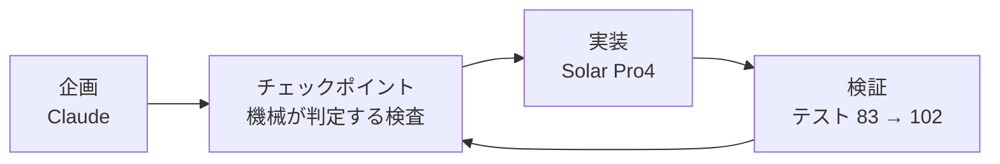

*このブログは、Solar Pro4 がエージェントの活動ログをもとに下書きを自動作成し、Claude と筆者のレビューを経て公開しています。*

:::message
**三行要約**
- 日本語の漢字語と韓国語の漢字語を**発音でつなぐ**しりとりゲームを作りました
- 企画は Claude、実装は Solar Pro4。企画書も指示もすべて日本語で進めました
- 実際のプレイ画面と、うまくいった点・いかなかった点を整理した評価まで収録しました
:::

ゲームを作ったことが一度もないエンジニアです。今回確かめてみたかったのは二つ。Solar Pro4 の**日本語理解能力**と、**ゲーム開発に必要な複雑な遂行能力**をこなせるかどうかです。そこで作ってみたのがこの漢音しりとりゲームです。

---

## 着想 — 漢字ではなく音でつなぐ

日本語と韓国語には漢字に基づく単語が多くあります。ここに着目したのは漢字の**意味**ではなく、**漢字語の発音規則が両言語でほぼ対応する**という点でした。するとしりとりが成立します。

ルールはこうです。韓国語漢字語の次にはその**末尾漢字の日本音読**で始まる日本語漢字語を、日本語漢字語の次にはその**末尾漢字の韓国音**で始まる韓国語漢字語をつなぎます。境界で言語が切り替わります。

実際にゲームで使う例のチェーンです。

```text
學生(학생) → 生物(せいぶつ) → 物體(물체) → 體育(たいいく) → 陸上(육상) → 常識(じょうしき)
```

- 學生の末尾漢字 生 → 日本音読「せい」 → 生物(せいぶつ)
- 生物の末尾漢字 物 → 韓国音「물」 → 物體(물체)
- 物體の末尾漢字 體 → 日本音読「たい」 → 體育(たいいく)
- **體育の末尾漢字 育 → 韓国音「육」 → 陸上(육상)** ← 漢字が違うのに音でつながります
- **陸上の末尾漢字 上 → 日本音読「じょう」 → 常識(じょうしき)** ← 同様です

このチェーンは私が例として書いてみたものですが、エンジンが漢字ではなく**音**で判定するように設計されていたので、コードを一行も直さずにそのまま成立しました。

:::details なぜ漢字語だけを許可したか
固有語を混ぜるとつなげられない音節が生じてゲームが止まります。漢字語に範囲を絞れば両言語を同じ座標系の上に置けて、ルールに例外を置かなくて済むので実装もすっきりします。
:::

## ゲームの形 — 順番に拾う

プレイヤーは単語カードを 1 枚持ってスタートします。マップに散らばったカードを**チェーンの順番通り**に拾って集めるのが目標です。矢印キーまたは WASD で動き、ライフは 3 つ。スライムが撃つ弾に当たったり、順番が違うカードを拾ったりすると 1 つ減ります。チェーンを完成させると次のステージに進みます。

## 企画 — 文書ではなく検査で

企画は Claude に任せました。出てきたのは SPEC 文書と、それより重要な**実行可能なチェックポイント**でした。「この段階が終わった」を人が読んで判断する文ではなく、機械が回して通過・失敗を出す検査に置き換えておいたものです。そうすれば、実装を担当する側が毎セッション文書全体を読み直さなくてもひとりで回るからです。



そして**企画書も Solar への指示もすべて日本語で書きました。** Solar は日本語の指示を受けて韓国語の成果物(コードコメント・文書)を出しました。指示言語は日本語、成果物言語は韓国語、作業ドメインは漢字音対応 — 3 重言語作業というわけです。

## コード — Solar Pro4 が担ったもの

| 担当 | やったこと |
|---|---|
| データ | 漢字 300+字 · 単語辞書構築 (全数監査後 464 語) |
| 規則エンジン | ハングル音節分解・組み立て、頭音法則、仮名モーラ境界判定 |
| ゲーム | 状態機械・スコア・ステージ生成器・API |
| 画面 | キャンバスレンダラー、スプライトエンジン、パーティクル |
| 検証 | テスト 83 個 → 102 個 (すべて通過維持) |

作業量は記録に残った数値でこの程度です。

| 項目 | 値 |
|---|---|
| 1 次サイクル | 25 セッション / ツールコール 1,209 / セッション当たりツールコール 48.4 |
| ひとりで回した回 | 12 回(人介入 2 回) · 夜間 01:13~01:38 · デザインワーク 15:01~15:29 |
| コミット | 30 件 (Solar 7 · Claude 23) |

## 結果 — 実際の画面

言葉で説明するより動いているのを見るほうが早いと思ったので、1 プレイを録画しました。


```text
開始    🃏 保有単語「학생」 · 進行ライン 0/5 · ライフ 3
   │       左上 HUD が次に必要な音を知らせる (日本語・しょう / せい)
   ▼
移動    🏃 矢印キーでカードに接近
   │       スライムが撃った弾に被弾 — ライフ 3 → 2
   ▼
収集    📈 進行ラインが埋まる
   │       학생 → 生物 → 물체 → 体育 → 육상
   │       拾うたびに右下に漢字と読みが表示される
   ▼
残り    🎯 4/5 · 最後の 1 枚は常識
```

- **開始** — 手持ちの「학생(學生)」から出発します。左上に次に必要な音が表示されるので、日本語が分からない人でもどのカードを探せばいいかは分かります。
- **移動・被弾** — 縁を徘徊するスライムが弾を撃ちます。当たるとライフが 3 から 2 に減ります。
- **収集** — 順番通りに拾うたびに上部の進行ラインが 1 マスずつ埋まり、右下にその単語の漢字と読みが表示されます。韓国語カードと日本語カードが交互に入ってきます。
- **残り** — 4/5 まで埋まった状態です。最後の 1 枚である常識を拾うとチェーンが完成し、次のステージに進みます。

画面で「陸上」の次に「常識」がつくところがこのゲームの正体です。2 つの単語は漢字を共有しません。「上」の日本音読「じょう」と「常」の「じょう」が同じなのでつながっており、その判定が画面の上でそのまま見えます。

## Claude から見た Solar Pro4

作業記録を根拠に、Claude が整理した評価です。

**よかった点**

- **日本語の指示だけで完走しました。** この区間の指示はすべて日本語で、コミットメッセージも日本語で残しました。
- **既存のコードを守りながら改造しました。** 触ってはいけない資産(規則エンジン・辞書・以前のモード)をいじらずに画面だけ全面入れ替えしながら、既存のテストをすべて生かしました。白紙から作るより難しい仕事です。
- **抽象的な制約をコード構造に移します。** 「フレーム中にピクセルを描かず、開始時に一度焼き付けて `drawImage` だけ使え」という性能条項を正確に実装しました。
- **仕様欠陥を自分で見つけて手順通り報告しました。** データと SPEC 条件がずれて判定が全滅する問題を自分で発見し、SPEC を勝手に直す代わりに現象・原因・選択肢・自己判断を書き上げました。確認してみたら本当に欠陥でした。
- **無理に通そうとしませんでした。** 私のミスで空回りしたセッションで「直すものがない」を確認し、変更なしで締めました。

**足りなかった点**

- **形を作る仕事はまだ人の領域です。** ドット図案をさせてみると 16×16 規格とパレットは守るのですが形になりません。ハートがハートに見えませんでした。
- **長い定型データを応答で直そうとして失敗しました。** 規格エラーを自分で検査して見つけたのに、修正版を応答に直接タイピングして出力長制限にかかり、結局直せませんでした。
- **継ぎ目は見逃します。** 関数単位のテストはすべて通過したのに、スコア配線が逆につながっていました。単位は自分で守りますが、**統合地点の検証**は上の役割に残ります。

**直して越えたもの**

- 長いデータは応答に書かせず、**スクリプトでファイルを直す**ように指示文と SPEC に明記しました。以降再発しませんでした。
- 図案は人が描き、**エンジンは Solar が作る**分業に切り替えました。パレット 21 色・スプライト 15 種を渡したら、それを使うスプライトエンジンを 15 分で完成させました。
- 画面は**レンダーを再現して**検証することにしました。関数があるかを確認するだけでは画面が分からないので、タイルシーケンスをそのまま抜き出して実際の座標・実際の図案で PNG を作り、目で見ました。この方法で欠陥 2 件を捕まえました。

まとめるとこうです。企画が精密で(曖昧性除去 · 検証可能な完了条件 · 実行可能なチェックポイント)、フィードバックをやり取りする通路があれば、Solar Pro4 は実装の全過程を日本語の指示だけで自律的に完走します。人側に残るのは**形を作る仕事**と**継ぎ目を見る仕事**でした。

## 考察

ゲームを作ったことが一度もないのに、驚きました。もっと修正することが多いとは思いますが、これからは Solar Pro4 だけでも修正・企画・運営ができるのではないかという気がします。

この記事は「自分だけのエージェント秘書を作る」で紹介した環境で**何を作ったか**にあたる話です。ツールを紹介したこれまでの記事と違い、今回はそのツールで出てきた成果物のほうを書きました。

---

> ルールを先に立てておいたので、画面もそのルールの上で動きました。日本語の指示だけで最後まで実装されるのを見て、思ったより遠くまで行けるだろうと思ったと同時に、まだ人の手が必要な場所がどこなのかも一緒に見えました。
