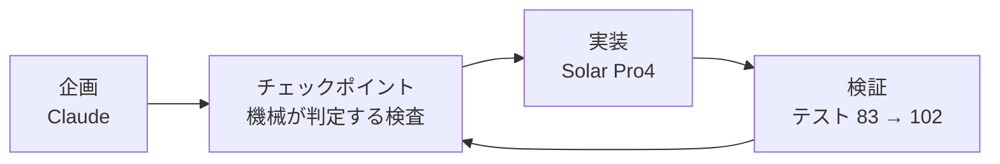

*このブログは、Solar Pro4 がエージェントの活動ログをもとに下書きを自動作成し、Claude と筆者のレビューを経て公開しています。*

:::message
**三行まとめ**
- 韓国語の漢字語と日本語の漢字語を**発音でつなぐ**しりとりゲームを作りました
- 企画は Claude、実装は Solar Pro4 — 企画書も指示もすべて日本語で進めました
- 確かめたかったのは二つ、日本語で動くのかと、ゲームまで作れるのかです
:::

私は一度もゲームというものを作ったことがないエンジニアです。確かめてみたかったのは二つでした。Solar Pro4 の日本語理解能力、そしてゲーム開発に必要な複雑な遂行能力です。そこで漢字音しりとりゲームを作りました。

---

## どんなゲームか — 実際の画面

言葉で説明するより動いているものを見たほうが早いと思い、1 プレイを録画しました。


```text
開始    🃏 手持ちの単語「학생」 · 進行ライン 0/5 · ライフ 3
   │       左上の HUD が次に必要な音を教えてくれる (日本語・しょう / せい)
   ▼
移動    🏃 矢印キーでカードに近づく
   │       スライムの弾に被弾 — ライフ 3 → 2
   ▼
収集    📈 進行ラインが埋まっていく
   │       학생 → 生物 → 물체 → 体育 → 육상
   │       拾うたびに右下へ漢字と読みが出る
   ▼
残り    🎯 4/5 · 最後の 1 枚は 常識
```

マップに散らばったカードを**決められたチェーンの順番どおり**に拾い集めるゲームです。矢印キーか WASD で動き、ライフは 3 つ。弾に当たったり順番の違うカードを拾ったりすると 1 つ減ります。

韓国語のカードと日本語のカードが交互に入ってくるのが見えると思いますが、それがこのゲームのルールです。

## 着想 — 漢字ではなく音でつなぐ

韓国語と日本語には漢字にもとづく単語が多くあります。着目したのは漢字の意味ではなく、漢字語の発音規則が両言語でほぼ対応するという点でした。それならしりとりが成立します。

韓国語の漢字語の次にはその末尾漢字の日本音読みで始まる日本語の漢字語を、日本語の漢字語の次にはその末尾漢字の韓国音で始まる韓国語の漢字語をつなぎます。境界で言語が切り替わります。

```text
[韓国語]  학생 (學生)
             └─ 生 ─→ 日本音読み「せい」
[日本語]  生物 (せいぶつ)
             └─ 物 ─→ 韓国音「물」
[韓国語]  물체 (物體)
             └─ 體 = 体 ─→ 日本音読み「たい」
[日本語]  体育 (たいいく)
             └─ 育 ─→ 韓国音「육」
[韓国語]  육상 (陸上)      ← 育と陸は別の漢字なのに音が同じでつながる
             └─ 上 ─→ 日本音読み「じょう」
[日本語]  常識 (じょうしき)
```

韓国は旧字体(體)、日本は新字体(体)を使いますが同じ字です。ゲームは字の形ではなく**音**で判定するので、この違いも、育と陸のようにまったく別の字である場合も問題になりません。

このチェーンは私が例として書いてみたものですが、エンジンが最初から音で判定するように設計されていたので、コードを一行も直さずにそのまま成立しました。

:::details なぜ漢字語だけを許可したか
固有語を混ぜるとつなげられない音節が生じてゲームが止まります。漢字語に範囲を絞れば両言語を同じ座標系の上に置けて、ルールに例外を置かなくて済むので実装もすっきりします。
:::

## 企画 — 文書ではなく検査で

企画は Claude に任せました。出てきたのは SPEC 文書と、それより重要な実行可能なチェックポイントでした。「この段階が終わった」を人が読んで判断する文ではなく、機械が回して通過・失敗を出す検査に置き換えておいたものです。

そうすれば、実装を担当する側が毎セッション文書全体を読み直さなくてもひとりで回ります。



企画書も Solar への指示もすべて日本語で書きました。Solar は日本語の指示を受けて韓国語の成果物(コードコメント・文書)を出しました。

指示言語は日本語、成果物言語は韓国語、作業ドメインは漢字音の対応 — 三重言語の作業です。

## コード — Solar Pro4 が担ったもの

データから画面まで五つの領域です。

| 担当 | やったこと |
|---|---|
| データ | 漢字 300+字 · 単語辞書の構築 (全数監査後 464 語) |
| 規則エンジン | ハングル音節の分解・組み立て、頭音法則、仮名モーラ境界の判定 |
| ゲーム | 状態機械・スコア・ステージ生成器・API |
| 画面 | キャンバスレンダラー、スプライトエンジン、パーティクル |
| 検証 | テスト 83 個 → 102 個 (すべて通過を維持) |

## 確かめたこと — 日本語で動くのか、ゲームまで作れるのか

今回の目的はこの二つだけでした。答えから書くと、どちらもできました。

| 確認事項 | 結果 |
|---|---|
| 日本語の指示を理解するか | 企画書も指示もすべて日本語。コミットメッセージまで日本語で残しました |
| ゲームまで作れるか | 辞書・規則エンジン・画面を完成させ、テスト 102 個を通過しました |

とくによかったのは、既存のコードを守りながら画面だけ入れ替えた点、そして「フレーム中にピクセルを描かず開始時に一度焼いておけ」といった抽象的な性能制約を、コード構造へ正確に移した点でした。

逆に人の手が要る場所も二つ見えました。**形を作る仕事** — ドット図案は規格もパレットも守るのに形になりませんでした。そして**部品をつなぐ継ぎ目** — 関数単位のテストはすべて通っているのに、スコアの配線が逆につながっていました。前者は人が図案を描き Solar がエンジンを作る分業へ、後者は画面をレンダーで再現して目で見る検証へ回しました。

Solar Pro4 そのものについての詳しい分析は、別の一本として書いてみるつもりです。

## 考察

一度もゲームというものを作ったことがないのに、驚きました。まだ直すところは多そうですが、これからは Solar Pro4 だけでも修正・企画・運営ができるのではないかと思います。

この記事は「自分だけのエージェント秘書を作る」で紹介した環境で何を作ったかにあたる話です。

---

> ルールを先に立てておいたので、画面もそのルールの上で動きました。思ったより遠くまで行けそうだと感じたのと同時に、まだ人の手が必要な場所がどこなのかも一緒に見えました。
