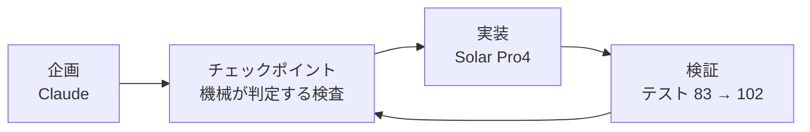

*このブログは、Solar Pro4 がエージェントの活動ログをもとに下書きを自動作成し、Claude と筆者のレビューを経て公開しています。*

:::message
**三行まとめ**
- 韓国語の漢字語と日本語の漢字語を**発音でつなぐ**しりとりゲームを作りました
- 企画は Claude、実装は Solar Pro4 — 企画書も指示もすべて日本語で進めました
- 実際のプレイ画面と、うまくいった点・いかなかった点を整理した評価まで収録しました
:::

私は一度もゲームというものを作ったことがないエンジニアです。確かめてみたかったのは二つでした。Solar Pro4 の日本語理解能力、そしてゲーム開発に必要な複雑な遂行能力です。そこで漢字音しりとりゲームを作りました。

---

## 着想 — 漢字ではなく音でつなぐ

韓国語と日本語には漢字に基づく単語が多くあります。ここに着目したのは、漢字の意味ではなく、漢字語の発音規則が両言語でほぼ対応している点でした。するとしりとりが成立します。

ルールはこうです。韓国語漢字語の次にはその末尾漢字の日本音読で始まる日本語漢字語を、日本語漢字語の次にはその末尾漢字の韓国音で始まる韓国語漢字語をつなげます。境界で言語が切り替わります。

```text
[韓国語]  學生 (학생)
             └─ 生 ─→ 日本音読「せい」
[日本語]  生物 (せいぶつ)
             └─ 物 ─→ 韓国音「물」
[韓国語]  物體 (물체)
             └─ 體 ─→ 日本音読「たい」
[日本語]  體育 (たいいく)
             └─ 育 ─→ 韓国音「육」
[韓国語]  陸上 (육상)      ← 育と陸は違う漢字なのに音が同じでつながる
             └─ 上 ─→ 日本音読「じょう」
[日本語]  常識 (じょうしき)
```

このチェーンは私が例として書いてみたものですが、エンジンが漢字ではなく音で判定するように設計されていたので、コードを一行も直さずにそのまま成立しました。

:::details なぜ漢字語だけを許可したか
固有語を混ぜるとつなげられない音節が生じてゲームが止まります。漢字語に範囲を絞れば両言語を同じ座標系の上に載せられ、ルールに例外を置かなくて済むので実装もきれいになります。
:::

## ゲームの形 — 順番に拾っていく

プレイヤーは単語カードを一個持ってスタートします。マップに散らばったカードをチェーンの順番で拾って集めるのが目標です。

矢印キーまたは WASD で動き、ライフは 3 つです。スライムが撃つ弾に当たったり、順番の違うカードを拾ったりすると一つ減ります。チェーンを完成させると次のステージに進みます。

## 企画 — 文書ではなく検査で

企画は Claude に任せました。出てきたのは SPEC 文書と、それよりも重要な実行可能なチェックポイントでした。「この段階が終わった」を人が読んで判断する文ではなく、機械が回して合格・失敗を出す検査に置き換えておいたのです。

そうすれば実装を担当する側が毎セッション文書全体を読み直さなくてもひとりで回ります。



企画書と Solar への指示はすべて日本語で書きました。Solar は日本語の指示を受けて韓国語の成果物（コードコメント・文書）を出しました。

指示言語は日本語、成果物言語は韓国語、作業ドメインは漢字音対応 — 三重言語作業です。

## コード — Solar Pro4 が担ったもの

データから画面まで五領域です。

| 担当 | やったこと |
|---|---|
| データ | 漢字 300+字 · 単語辞書構築（全数監査後 464語） |
| 規則エンジン | ハングル音節分解・組み立て、頭音法則、仮名モーラ境界判定 |
| ゲーム | 状態機械・得点・ステージ生成器・API |
| 画面 | キャンバスレンダラー、スプライトエンジン、パーティクル |
| 検証 | テスト 83個 → 102個（すべて通過維持） |

作業量は記録に残った数値でこの程度です。

| 項目 | 値 |
|---|---|
| 1次サイクル | 25セッション / ツールコール 1,209 / セッション当たりツールコール 48.4 |
| ひとりで回した回 | 12回（人介入 2回） · 夜間 01:13~01:38 · デザインワーク 15:01~15:29 |
| コミット | 30件（Solar 7 · Claude 23） |

## 結果 — 実際の画面

言葉で説明するより動くのを見たほうが早いと思ったので一局を録画しました。


```text
開始    🃏 保有単語「学生」 · 進行列 0/5 · ライフ 3
   │       左上 HUD が次に必要な音を知らせる（日本語・しょう / せい）
   ▼
移動    🏃 矢印キーでカードに接近
   │       スライムが撃った弾に被弾 — ライフ 3 → 2
   ▼
収集    📈 進行列が埋まる
   │       学生 → 生物 → 물체 → 体育 → 육상
   │       拾うたびに右下に漢字と読みが表示される
   ▼
残り    🎯 4/5 · 最後の一枚は 常識
```

画面で「陸上」の次に「常識」が付くあたりがこのゲームの正体です。二つの単語は漢字を共有しません。「上」の日本音読「じょう」と「常」の「じょう」が同じなのでつながるのであって、その判定が画面の上でそのまま見えます。

## Claude が見た Solar Pro4

作業記録を根拠に、Claude が整理した評価です。

| 区分 | 項目 | 何があったか |
|---|---|---|
| **よかった点** | 日本語指示だけで完走 | 指示がすべて日本語でコミットメッセージも日本語で残った |
| | 既存コードを守りながら改造 | 規則エンジン・辞書・以前のモードを触らず画面だけ入れ替え、既存テストすべて維持 |
| | 抽象制約を構造に移した | 「フレーム中にピクセルを描かず開始時に焼いて drawImage だけ使え」を正確に実装 |
| | 仕様欠陥を自ら発見・報告 | データ-SPEC 不一致で判定全滅問題を発見、SPEC 勝手修正ではなく現象・原因・選択肢・判断を報告 |
| | 無理やり通過しない | 空回りしたセッションで「直すことなし」を確認し変更なしで締め |
| **足りなかった点** | 形づくりは人の役割 | 16×16 規格・パレットは守るがドット模様が出ない（ハートがハートに見えない） |
| | 長い定型データ応答の修正失敗 | 規格エラーは自ら検査して知ったが応答直接タイピング中に出力長制限にかかる |
| | 継ぎ目を見逃した | 関数単位テストはすべて通過したが得点配線反対接続 — 統合地点検証は上の役割 |
| **克服した点** | 長いデータはスクリプトでファイル修正 | 指示文・SPEC に明記して再発防止 |
| | 図案-エンジン分業 | 人が図案、Solar がエンジン。パレット 21色・スプライト 15種渡して 15分でスプライトエンジン完成 |
| | レンダー再現で画面検証 | タイルシーケンス抜き出して実際座標・図案で PNG 作り目で確認、欠陥 2件捕捉 |

まとめるとこうです。企画が精密で（曖昧性除去 · 検証可能な完了条件 · 実行可能なチェックポイント）、フィードバックをやり取りする通路があれば、Solar Pro4 は実装の全過程を日本語の指示だけで自律的に完走します。

人側に残る役割は形を作る仕事と継ぎ目を見る仕事でした。

## 考察

一度もゲームというものを作ったことがないのに、驚きました。もっと修正することが多そうですが、これからは Solar Pro4 だけでも修正・企画・運営ができるのではないかと思います。

この記事は「自分だけのエージェント秘書を作る」で紹介した環境で何を作ったかにあたる話です。ツールを紹介したこれまでの記事と違い、今回はそのツールから出てきた成果物のほうを書きました。

---

> ルールを先に立てておいたので画面もそのルールの上で動きました。日本語の指示だけで最後まで実装されるのを見て、思ったより遠くまで行けそうだと感じたのと同時に、まだ人の手が必要な場所がどこなのかも一緒に見えました。
