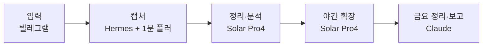

:::message
**세 줄 요약**
- 매일 놓칠 수 있었던 생각과 지식이 하나의 저장소로 쌓이도록, 메신저로 던지는 지식 인박스 시스템을 만들었습니다
- 캡처·정리·회고를 단계별로 나누고, 데이터 경계와 모델 역할을 분리해 설계했습니다
- 이 편은 구성 소개였던 1편에서 예고한 첫 실전편입니다. 실제로 어떻게 움직이는지까지 다룹니다
:::

거창한 계획에서 시작한 건 아니었어요. 매일 떠오르는 생각이나 알게 된 것들이 여기저기 흩어지고, 그대로 놓칠 수 있는 것들이었습니다. 그래서 그걸 그냥 쌓아두는 곳을 하나 만들고 싶었고, 그게 이 지식 인박스입니다.

이 글은 1편에서 예고한 "실제로 뭘 했는지"의 첫 편입니다. 구성만 소개했던 지난 편과 달리, 이번에는 어떤 흐름으로 들어와서 어떻게 정리되고, 어디까지 자동화되는지를 다룹니다.

---

## 나에게 생긴 변화 — 흩어지던 것들이 한곳으로

이 시스템에서 가장 크게 느낀 건 **매일 놓칠 수 있었던 기억·지식·고찰이 하나의 지식 저장소로 통합됐다**는 점입니다. 휴대폰으로 생각나는 걸 아무렇게나 던져도 원본을 잃지 않고 남고, 나중에 그걸 다시 꺼내 볼 수 있게 됐습니다.

아직 쌓인 양이 많지는 않지만, 앞으로 계속 쌓여갈 거라는 기대가 있습니다. 그리고 이 지식을 활용해서 또 다른 가치를 만들고 싶다는 생각도 자연스럽게 따라왔습니다. 단순히 모으는 데서 끝나지 않고, 모인 것들이 다시 쓸모 있는 형태로 이어졌으면 했습니다.

이 글의 흐름도 그 순서를 따릅니다. 먼저 전체 설계를 짧게 잡고, 그다음 실제로 어떻게 움직이는지, 데이터 구조와 모델 역할을 정리합니다.

## 전체 설계 — 다섯 조각으로 나눴다

핵심은 **들어오는 건 가볍게, 정리와 회고는 뒤에**입니다. 캡처할 때 아무것도 묻지 않고, 정리와 해석은 따로 처리합니다.

| 역할 | 담당 | 하는 일 |
|---|---|---|
| 간단한 채팅 | 로컬 Qwen | 입력 접점과 가벼운 상호작용 |
| STT | 로컬 whisper | 음성 원본을 전사 |
| 인풋 분석·분류 | Solar Pro4 | 들어온 내용을 정리하고 유형·주제로 분류 |
| 매일 밤 지식 확장 | Solar Pro4 | 배경·맥락·연결 개념을 보완 |
| 금요일 정리·인사이트·투두 보고 | Claude | 주간 회고, 주제 허브, 알림 정리 |

설계할 때 중요하게 본 건 역할을 섞지 않는 것이었습니다. 캡처는 빠르고 단순하게, 정리와 해석은 더 많은 맥락을 다룰 수 있는 모델이 맡는 식으로 나눴습니다.

## 캡처 — 10초, 절대 되묻지 않는다

캡처는 최대한 마찰이 없어야 한다고 생각했습니다. 그래서 원칙은 두 가지입니다.

- 캡처는 10초 안에 끝난다
- 캡처할 때 절대 되묻지 않는다

휴대폰 텔레그램으로 텍스트, 음성, 링크, 사진을 던져두면 Hermes 게이트웨이를 거쳐 1분 폴러가 기계적으로 저장합니다. 캡처 자체는 LLM에 의존하지 않습니다. 정리나 해석이 느려지거나 멈춰도, 들어온 원본은 남아 있어야 하니까요.

입력 유형은 이렇게 나뉩니다.

- 텍스트
- 음성 — 로컬 whisper로 전사
- 링크 — 본문 스냅샷
- 사진 — OCR

민감한 내용은 메시지 앞에 `#p`를 붙이면 로컬 전용으로 분리됩니다. 이 경우 클라우드 정리 대상에서 빠집니다.

:::details 캡처할 때 묻지 않는 이유
캡처 시점에 질문이나 확인을 넣으면 입력이 멈춥니다. 그래서 캡처는 무조건 빠르게 끝내고, 분류나 해석은 뒤에서 처리합니다. 캡처와 정리가 분리돼 있으면 정리 쪽이 잠시 멈춰도 들어오는 데이터는 살아 있습니다.
:::

## 데이터 구조 — 원본은 남기고, 정리는 뒤에서

데이터는 세 층으로 나눴습니다.

1. **inbox** — 원본. 들어온 그대로 보존하고 바꾸지 않습니다.
2. **vault** — 정리된 기록. 1인칭 기록 노트와 주제당 1장씩 갱신되는 지식 카드가 여기 들어갑니다.
3. **_views** — 모아보기. 질문, 행동, 주간 회고처럼 다시 생성 가능한 뷰를 둡니다.

처리 과정은 `index/`에 장부처럼 남습니다.

아키텍처에서 중요한 결정은 데이터 경계였습니다. 기존 하네스에는 로컬 모델만 보는 `personal`과 공개 가능한 `public`이 있었는데, 그 사이에 `knowledge` 등급을 새로 만들었습니다. `~/data/knowledge/`에 저장하고, 메신저로 보낸 순간 이미 기기 밖을 경유한 데이터로 간주해 Solar의 클라우드 정리를 허용합니다.

다만 예외가 있습니다.

- 음성 원본 파일은 `knowledge` 등급이라도 클라우드로 보내지 않고, 로컬 whisper로 전사합니다.
- 진짜 민감한 내용은 `#p`를 붙여 `personal`로 보내고, Solar 처리에서 제외합니다.
- `~/data/knowledge/`는 로컬 git으로 버전 관리하고, 원격 push는 하지 않습니다.

이 경계 덕분에 "어디까지 클라우드에 맡겨도 되는지"가 분명해졌습니다.

## 정리와 회고 — Solar가 상시, Claude가 판단을 돕는다

정리는 Solar Pro4가 담당합니다. 들어온 인풋을 분석·분류하고, 기록 노트와 지식 카드로 정리합니다. 정리본에는 원본을 가리키는 정보, 유형, 주제, 출처, 상태, 관련 항목 같은 frontmatter와 함께 요약·원문·해석이 들어갑니다.

매일 밤 22시에는 지식 확장 배치가 돌아갑니다. 이때는 LLM 해석으로 배경, 원전 맥락, 연결 개념을 보완합니다. 웹 검색은 사실 확인이 필요할 때만 보조로 쓰고, 웹으로 확인한 내용은 출처 URL을 남깁니다. 해석만 들어간 부분은 "웹 미확인"으로 구분합니다. 확인이 안 되면 억지로 지어내지 않고 금요일로 넘깁니다.

금요일 21:04에는 회고가 생성됩니다. 주간 회고와 주제 허브, 알림 역할을 하는 투두·인사이트를 만들어 텔레그램으로 보고합니다. 이때 남은 웹 조사도 함께 처리합니다.

즉, **상시 정리와 확장은 Solar, 판단이 더 필요한 고차 작업은 Claude**가 맡는 구조입니다.

## 실제로 움직이기까지의 기준

이 프로젝트는 문서와 로그를 기반으로 단계적으로 확인하면서 만들었습니다. 각 단계마다 "됐다"고 볼 수 있는 기준을 정해둔 게 도움이 됐습니다.

| 단계 | 확인 기준 |
|---|---|
| V1 캡처 | 실제 휴대폰에서 텍스트·링크·음성 각 1건을 보내 inbox에 원본 3건이 파일로 남고, 로컬 음성 전사에 오디오 파일과 전사 텍스트 쌍이 생기며, `#p` 분기와 캡처 매니페스트가 작동할 것 |
| V2 정리 | 실제 캡처 10건 이상이 vault에 스키마 준수 100%로 정리되고, 원본 해시가 정리 전후 동일할 것. 오너가 10건의 유형과 태그를 훑고 수긍할 수 있어야 할 것 |
| V3 검색 | 한 달치 실데이터에서 "지난달 내가 X에 대해 뭐라고 했지"류 질문 3개에 원문 근거와 함께 답할 것 |
| V4 회고 | 2주 연속 생성물이 나오고, 오너가 실제로 읽을 것 |

이 기준 덕분에 "그냥 돌아가는 것"과 "쓸 수 있는 것"을 구분할 수 있었습니다.

## 아직 남아 있는 부분

완벽한 시스템은 아니어서, 실제로 쓰면서 드러나는 지점도 있습니다.

- 텔레그램 음성의 오디오 원본이 전사 후 버려져 미보존 상태로 남은 경우가 있었습니다.
- 사진 OCR은 스타일 이미지 등에서 품질 한계가 보일 수 있습니다.
- 지식 확장이 억지 연결이 되지 않도록 "직접 관련될 때만 기존 카드에 덧붙인다"는 규칙을 두고 지켜보고 있습니다.

이런 부분은 원본 보존과 재처리 가능성으로 방어하고 있습니다. 그래서 운영할 때도 `#p` 분기, 로컬 전사, git 버전 관리 같은 경계 규칙을 계속 유지해야 합니다.

---

> 흩어지던 생각과 지식이 한곳으로 모이기 시작했다는 것만으로도 꽤 달라졌습니다. 아직은 시작이지만, 앞으로 쌓일 것들을 보면서 이 지식을 또 다른 가치로 이어보는 쪽으로 계속 써보려 합니다.
