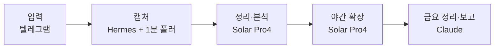

*이 블로그는 Solar Pro4가 에이전트의 활동 로그를 바탕으로 초안을 자동 작성하고, Claude와 필자의 검수를 거쳐 게재됩니다.*

:::message
**세 줄 요약**
- 떠오르는 생각·링크·사진을 텔레그램에 던지면, 알아서 정리되고 밤마다 확장되는 지식 저장소를 만들었습니다
- 캡처는 로컬에서 즉시, 정리·확장은 Solar Pro4, 금요일 회고는 Claude — 역할을 나눴습니다
- 책 한 페이지가 지식 카드가 되는 실제 흐름까지 담았습니다
:::

거창한 계획에서 시작한 건 아니었어요. 매일 떠오르는 생각과 알게 된 것들이 여기저기 흩어진 채 사라지는 게 아까웠고, 그냥 던져두면 알아서 쌓이는 곳을 만들고 싶었습니다. 그렇게 만든 게 이 지식 인박스입니다. 구성만 소개했던 1편과 달리, 이번 편은 실제로 어떻게 움직이는지입니다.

---

## 무엇이 달라졌나

가장 큰 변화는 **매일 놓칠 수 있었던 기억·지식·고찰이 한곳에 쌓이기 시작했다**는 것입니다. 휴대폰으로 아무렇게나 던져도 원본이 남고, 나중에 다시 꺼내 볼 수 있습니다. 아직 양은 적지만 앞으로 쌓여갈 게 기대되고, 이 지식으로 또 다른 가치를 만들어보고 싶다는 생각이 자연스럽게 따라왔습니다.

## 전체 설계 — 다섯 조각

핵심은 **들어오는 건 가볍게, 정리와 해석은 뒤에서**입니다.



| 역할 | 담당 | 하는 일 |
|---|---|---|
| 간단한 채팅 | 로컬 Qwen | 입력 접점과 가벼운 상호작용 |
| STT | 로컬 whisper | 음성 원본을 전사 |
| 인풋 분석·분류 | Solar Pro4 | 들어온 내용을 정리하고 유형·주제로 분류 |
| 매일 밤 지식 확장 | Solar Pro4 | 배경·맥락·연결 개념을 보완 |
| 금요일 정리·보고 | Claude | 주간 회고, 주제 허브, 투두·인사이트 알림 |

역할을 섞지 않는 것이 설계의 축입니다. 캡처는 빠르고 단순하게, 해석은 더 많은 맥락을 다룰 수 있는 모델에게 맡깁니다.

## 캡처 — 10초, 되묻지 않는다

원칙은 두 가지입니다. **캡처는 10초 안에 끝난다. 캡처할 때 절대 되묻지 않는다.**

텔레그램에 던지면 1분 폴러가 기계적으로 저장합니다. 캡처 자체는 LLM에 의존하지 않아서, 정리 쪽이 멈춰도 원본은 남습니다.

- 텍스트 — 그대로 저장
- 음성 — 로컬 whisper로 전사
- 링크 — 본문 스냅샷
- 사진 — 원본 + OCR 텍스트

민감한 내용은 앞에 `#p`를 붙이면 로컬 전용으로 분리되고, 클라우드 정리 대상에서 빠집니다.

:::details 캡처할 때 묻지 않는 이유
캡처 시점에 질문이나 확인을 넣으면 입력이 멈춥니다. 그래서 캡처는 무조건 빠르게 끝내고, 분류나 해석은 뒤에서 처리합니다. 캡처와 정리가 분리돼 있으면 정리 쪽이 잠시 멈춰도 들어오는 데이터는 살아 있습니다.
:::

## 데이터 구조 — 원본 · 노트 · 카드

데이터는 세 층입니다.

1. **inbox** — 원본. 들어온 그대로, 바꾸지 않습니다.
2. **vault** — 정리된 기록. **기록 노트**와 **지식 카드**가 여기 들어갑니다.
3. **_views** — 질문·행동·주간 회고 모아보기. 언제든 다시 생성할 수 있습니다.

vault의 두 형식이 이 시스템의 중심입니다.

| | 기록 노트 | 지식 카드 |
|---|---|---|
| 단위 | 캡처 1건당 1개 | 주제당 1장 |
| 시점 | "내가 그때 뭐라고 했나" (1인칭) | "그래서 무엇을 알게 됐나" (객관) |
| 내용 | 요약 + 원문 + 해석 | 정리된 지식 + 확장 덧붙임 |
| 변화 | 쓰고 나면 그대로 | 관련 입력이 올 때마다 이력이 쌓이며 갱신 |

기록 노트는 그날의 나를 남기고, 지식 카드는 주제를 남깁니다. 같은 주제를 또 던지면 노트는 새로 생기고, 카드는 두꺼워집니다.

경계 규칙도 여기서 정했습니다. 메신저를 거친 데이터는 `knowledge` 등급으로 두고 Solar의 클라우드 정리를 허용하되 —

- 음성 원본은 클라우드로 보내지 않고 로컬 whisper로만 전사합니다.
- 진짜 민감한 내용은 `#p`로 `personal` 등급에 분리합니다.
- 저장소는 로컬 git으로만 버전 관리합니다 (원격 push 없음).

이 경계 덕분에 "어디까지 클라우드에 맡겨도 되는지"가 분명해졌습니다.

## 정리·확장·회고 — Solar가 상시, Claude가 마무리

- **정리 (Solar Pro4, 상시)** — 들어온 인풋을 분석·분류해 기록 노트와 지식 카드로 만듭니다.
- **확장 (Solar Pro4, 매일 22시)** — 카드에 배경·원전 맥락·연결 개념을 덧붙입니다. 웹 검색은 사실 확인이 필요할 때만 씁니다. 웹으로 확인한 건 출처 URL을 남기고, 해석만인 건 **"웹 미확인"**으로 표시합니다. 확인이 안 되면 지어내지 않고 금요일로 넘깁니다.
- **회고 (Claude, 금요일 밤)** — 주간 회고·주제 허브·투두 알림을 만들어 텔레그램으로 보고합니다. 남은 웹 조사도 이때 처리합니다.

## 실제 예시 — 니체 책 한 페이지가 지식 카드가 되기까지

밤 12시가 넘은 시각, 읽던 니체 책의 한 페이지를 사진으로 찍고, "요즘 바쁘기만 하고 일의 방향이 흐릿하다"는 짧은 성찰을 붙여 텔레그램에 던졌습니다. 그 뒤 하루 동안 일어난 일입니다.

```text
00:13   📷 책 사진 + 짧은 성찰
   │       폴러가 원본 그대로 inbox에 저장 (이미지 원본 + OCR 텍스트)
   ▼
00:15   📝 기록 노트 2건 + 지식 카드 1장          … Solar Pro4
   ▼
22:00   🔍 야간 확장                              … Solar Pro4
   │       ├ 기존 카드에 해석 덧붙임 ("웹 미확인" 표시)
   │       └ 책 페이지는 새 카드 1장으로 분리
   ▼
금요일   📬 주간 회고 + 투두·인사이트 알림          … Claude
```

- **캡처** — 사진은 조판 탓에 OCR이 많이 깨졌지만, 이미지 원본이 남아 있어 나중에 다시 추출하면 됩니다. 되묻지 않고 여기서 끝.
- **정리** — 성찰은 유형(생각·고찰)과 주제 태그가 붙은 기록 노트가 되고, 거기서 "일의 가치와 목적을 먼저 맞춘다"는 첫 지식 카드가 생겼습니다.
- **확장 ①** — 밤 10시 배치가 그 카드에 동기와 일의 의미에 관한 배경 개념, "정렬에만 매달리면 실행이 늦어진다"는 주의점까지 해석을 덧붙였습니다. **"해석 — 웹 미확인"** 표시와 함께.
- **확장 ②** — 책 페이지의 메시지("무엇을 물을지 하나만 고른다", "달리는 속도가 길의 방향을 보장하지 않는다")는 기존 카드와 주제가 달라서, 억지로 붙이지 않고 새 카드 **「질문 축소와 방향-속도 구분」**이 됐습니다. 에센셜리즘, 선택과 집중 같은 '빼기의 철학' 계보와 연결된 카드입니다.

즉흥적으로 던진 사진 한 장과 성찰 하나가, 하루 만에 서로 연결된 지식 카드 두 장이 됐습니다.

카드는 주제당 1장 갱신형이라, 비슷한 생각을 또 던지면 이 카드에 이력이 쌓입니다. 몇 달 뒤 "내가 이 주제에 대해 뭐라고 해왔더라"를 물으면 카드 한 장과 원문 근거로 답할 수 있고, 반복해서 떠오르는 주제는 금요 회고가 먼저 알려줄 겁니다. 그렇게 쌓인 카드를 글감과 판단의 재료로 쓰는 것 — 그게 "지식으로 또 다른 가치를 만든다"의 구체적인 모습입니다.

---

> 흩어지던 생각과 지식이 한곳으로 모이기 시작했다는 것만으로도 꽤 달라졌습니다. 아직은 시작이지만, 앞으로 쌓일 것들을 보면서 이 지식을 또 다른 가치로 이어보는 쪽으로 계속 써보려 합니다.
