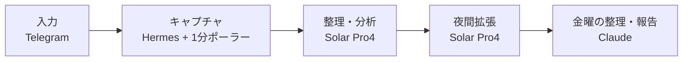

*このブログは、Solar Pro4 がエージェントの活動ログをもとに下書きを自動作成し、Claude と筆者のレビューを経て公開しています。*

:::message
**3行まとめ**
- 思いついた考え・リンク・写真をTelegramに投げると、自動で整理され、毎晩拡張される知識ストアを作りました
- キャプチャはローカルで即時、整理・拡張はSolar Pro4、金曜の振り返りはClaude — と役割を分けました
- 本の1ページが知識カードになる実際の流れまで載せています
:::

大きな計画から始めたわけではありません。毎日思いつく考えや知ったことがあちこちに散らばったまま消えていくのがもったいなくて、とりあえず投げておけば勝手に積み上がる場所が欲しかった。そうして作ったのがこの知識インボックスです。構成紹介だった1回目と違い、今回は実際にどう動くかの話です。

---

## 何が変わったか

いちばん大きな変化は、**毎日取りこぼしていたかもしれない記憶・知識・考察が、ひとつの場所に積み上がり始めた**ことです。スマホから雑に投げても原本が残り、あとから取り出せます。まだ量は少ないですが、これから積み上がっていくのが楽しみで、この知識で別の価値を作ってみたいという気持ちも自然についてきました。

## 全体の設計 — 5つのピース

核心は**入ってくるものは軽く、整理と解釈はあとで**です。



| 役割 | 担当 | やること |
|---|---|---|
| 簡単なチャット | ローカル Qwen | 入力の接点と軽いやりとり |
| STT | ローカル whisper | 音声原本の文字起こし |
| 入力の分析・分類 | Solar Pro4 | 入ってきた内容を整理し、種類・トピックで分類 |
| 毎晩の知識拡張 | Solar Pro4 | 背景・文脈・関連概念を補完 |
| 金曜の整理・報告 | Claude | 週間振り返り、トピックハブ、TODO・インサイト通知 |

役割を混ぜないことが設計の軸です。キャプチャは速く単純に、解釈はより多くの文脈を扱えるモデルに任せます。

## キャプチャ — 10秒、聞き返さない

原則は2つです。**キャプチャは10秒で終わる。キャプチャのとき絶対に聞き返さない。**

Telegramに投げると1分ポーラーが機械的に保存します。キャプチャ自体はLLMに依存しないので、整理側が止まっても原本は残ります。

- テキスト — そのまま保存
- 音声 — ローカル whisper で文字起こし
- リンク — 本文スナップショット
- 写真 — 原本 + OCRテキスト

センシティブな内容は先頭に `#p` を付けるとローカル専用に分離され、クラウド整理の対象から外れます。

:::details キャプチャのとき聞き返さない理由
キャプチャの時点で質問や確認を挟むと、入力が止まります。だからキャプチャは必ず速く終わらせ、分類や解釈はあとで処理します。キャプチャと整理が分かれていれば、整理側がしばらく止まっても入ってくるデータは生きています。
:::

## データ構造 — 原本・ノート・カード

データは3層です。

1. **inbox** — 原本。入ってきたまま、変えません。
2. **vault** — 整理された記録。**記録ノート**と**知識カード**がここに入ります。
3. **_views** — 問い・行動・週間振り返りのまとめビュー。いつでも再生成できます。

vaultの2つの形式がこのシステムの中心です。

| | 記録ノート | 知識カード |
|---|---|---|
| 単位 | キャプチャ1件につき1つ | トピックごとに1枚 |
| 視点 | 「自分はあのとき何と言ったか」(一人称) | 「それで何が分かったか」(客観) |
| 内容 | 要約 + 原文 + 解釈 | 整理された知識 + 拡張の追記 |
| 変化 | 書いたらそのまま | 関連する入力が来るたびに履歴が積まれて更新 |

記録ノートはその日の自分を残し、知識カードはトピックを残します。同じトピックをまた投げると、ノートは新しく増え、カードは厚くなります。

境界のルールもここで決めました。メッセンジャーを経由したデータは `knowledge` 等級としてSolarのクラウド整理を許可しつつ——

- 音声の原本はクラウドに送らず、ローカル whisper だけで文字起こしします。
- 本当にセンシティブな内容は `#p` で `personal` 等級に分離します。
- ストアはローカル git だけでバージョン管理します(リモート push なし)。

この境界のおかげで、「どこまでクラウドに任せていいか」がはっきりしました。

## 整理・拡張・振り返り — Solarが常時、Claudeが締める

- **整理(Solar Pro4、常時)** — 入ってきた入力を分析・分類し、記録ノートと知識カードにします。
- **拡張(Solar Pro4、毎晩22時)** — カードに背景・原典の文脈・関連概念を追記します。ウェブ検索は事実確認が必要なときだけ。ウェブで確認したものは出典URLを残し、解釈だけのものは**「ウェブ未確認」**と表示します。確認できなければでっち上げず、金曜に回します。
- **振り返り(Claude、金曜の夜)** — 週間振り返り・トピックハブ・TODO通知を作ってTelegramに報告します。残ったウェブ調査もこのとき処理します。

## 実例 — ニーチェの本の1ページが知識カードになるまで

深夜0時すぎ、読んでいたニーチェの本の1ページを写真に撮り、「最近、忙しいだけで仕事の方向がぼやけている」という短い省察を添えてTelegramに投げました。その後の1日に起きたことです。

```text
00:13   📷 本の写真 + 短い省察
   │       ポーラーが原本のままinboxに保存 (画像原本 + OCRテキスト)
   ▼
00:15   📝 記録ノート2件 + 知識カード1枚          … Solar Pro4
   ▼
22:00   🔍 夜間拡張                               … Solar Pro4
   │       ├ 既存カードに解釈を追記 (「ウェブ未確認」ラベル)
   │       └ 本のページは新しいカード1枚として分離
   ▼
金曜日   📬 週間振り返り + TODO・インサイト通知     … Claude
```

- **キャプチャ** — 写真は組版のせいでOCRがかなり崩れましたが、画像の原本が残っているので、あとで再抽出すればいい。聞き返さずにここで終わり。
- **整理** — 省察は種類(考え・考察)とトピックタグが付いた記録ノートになり、そこから「仕事の価値と目的を先に揃える」という最初の知識カードが生まれました。
- **拡張①** — 夜10時のバッチがそのカードに、動機や仕事の意味に関する背景概念、「すり合わせにばかりこだわると実行が遅れる」という注意点まで解釈を追記しました。**「解釈 — ウェブ未確認」**のラベル付きで。
- **拡張②** — 本のページのメッセージ(「何を問うかをひとつだけ選ぶ」「走る速さは道の方向を保証しない」)は既存カードとトピックが違うため、無理につなげずに新しいカード**「問いの絞り込みと方向・速度の区別」**になりました。エッセンシャリズムや選択と集中といった「引き算の哲学」の系譜とつながったカードです。

思いつきで投げた写真1枚と省察ひとつが、1日で互いにつながった知識カード2枚になりました。

カードはトピックごとに1枚の更新型なので、似た考えをまた投げればこのカードに履歴が積まれます。数か月後に「自分はこのテーマについて何を考えてきたっけ」と聞けば、カード1枚と原文の根拠で答えられますし、繰り返し浮かぶトピックは金曜の振り返りが先に教えてくれるはずです。そうして積み上がったカードを記事のネタや判断の材料に使うこと——それが「知識で別の価値を作る」の具体的な姿です。

---

> 散らばっていた考えや知識がひとつの場所に集まり始めただけでも、かなり変わりました。まだ始まりですが、これから積み上がるものを見ながら、この知識を別の価値につなげていく方向で使い続けようと思います。
