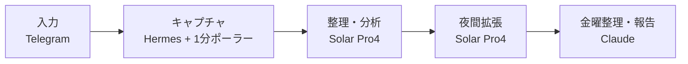

*このブログは、Solar Pro4 がエージェントの活動ログをもとに下書きを自動作成し、Claude と筆者のレビューを経て公開しています。*

:::message
**3行まとめ**
- 毎日見逃してしまうかもしれない考えや知識を、ひとつの保管場所に積み上げられるように、メッセンジャーで投げ込む知識インボックスシステムを作りました
- キャプチャ・整理・振り返りを段階に分け、データ境界とモデルの役割を分けて設計しました
- この回は構成紹介だった1回目で予告した、最初の実践編です。実際にどう動くかまで扱います
:::

大きな計画から始めたわけではありません。毎日浮かぶ考えや知ったことがあちこちに散らばって、そのまま見逃してしまうものでした。だからそれをそのままためておく場所をつくりたくて、それがこの知識インボックスです。

この記事は1回目で予告した「実際に何をしたか」の最初の回です。構成だけ紹介した前回と違って、今回はどんな流れで入ってきてどう整理され、どこまで自動化されるかを扱います。

---

## 自分に起きた変化 — 散らばっていたものがひとつの場所に

このシステムでいちばん大きく感じたのは、**毎日見逃していたかもしれない記憶・知識・考察が、ひとつの知識リポジトリに統合された**という点です。スマホで思いついたことを適当に投げても、原本を失わずに残り、あとで取り出して見返せるようになりました。

まだ積み上がった量は多くありませんが、これからも積み上がっていくという期待があります。そしてこの知識を使って別の価値も作りたいという思いも、自然についてきました。単に集めるだけで終わらず、集まったものが再び使える形につながってほしいと思いました。

この記事の流れもその順番に沿っています。まず全体の設計を短く押さえ、そのあと実際にどう動くか、データ構造とモデルの役割を整理します。

## 全体の設計 — 5つのピースに分けた

核心は**入ってくるのは軽く、整理と振り返りはあとで**です。キャプチャするときに何も聞かず、整理と解釈は別で処理します。

| 役割 | 担当 | やること |
|---|---|---|
| 簡単なチャット | ローカル Qwen | 入力の受け口と軽いやり取り |
| STT | ローカル whisper | 音声原本を文字起こし |
| 入力分析・分類 | Solar Pro4 | 入ってきた内容を整理し、種類・テーマに分類 |
| 毎晩の知識拡張 | Solar Pro4 | 背景・文脈・つながる概念を補完 |
| 金曜の整理・インサイト・ToDo報告 | Claude | 週次の振り返り、テーマハブ、通知整理 |

設計のときに大事にしたのは、役割を混ぜないことでした。キャプチャは速くシンプルに、整理と解釈はより多くの文脈を扱えるモデルが担当するように分けました。

## キャプチャ — 10秒、絶対に聞き返さない

キャプチャはなるべく摩擦がないべきだと思いました。だから原則は2つです。

- キャプチャは10秒で終わる
- キャプチャするときに絶対に聞き返さない

スマホのTelegramでテキスト、音声、リンク、写真を投げておくと、Hermesゲートウェイを経て1分ポーラーが機械的に保存します。キャプチャ自体はLLMに依存しません。整理や解釈が遅くなったり止まったりしても、入ってきた原本は残っていなければいけないからです。

入力の種類はこう分けられます。

- テキスト
- 音声 — ローカル whisperで文字起こし
- リンク — 本文スナップショット
- 写真 — OCR

センシティブな内容はメッセージの前に`#p`を付けると、ローカル専用として分離されます。この場合、クラウド整理の対象から外れます。

:::details キャプチャのときに聞かない理由
キャプチャの時点で質問や確認を入れると、入力が止まります。だからキャプチャはとにかく速く終わらせ、分類や解釈はあとで処理します。キャプチャと整理が分かれていると、整理側がしばらく止まっても入ってくるデータは生きています。
:::

## データ構造 — 原本は残し、整理はあとで

データは3層に分けました。

1. **inbox** — 原本。入ってきたまま保存し、変えません。
2. **vault** — 整理された記録。1人称の記録ノートと、テーマごとに1枚ずつ更新される知識カードがここに入ります。
3. **_views** — まとめて見る場所。質問、行動、週次の振り返りのように再生成可能なビューを置きます。

処理の過程は`index/`に帳簿のように残ります。

アーキテクチャで大事にした判断は、データ境界でした。既存のハーネスにはローカルモデルだけが見る`personal`と、公開可能な`public`があったのですが、その間に`knowledge`グレードを新しく作りました。`~/data/knowledge/`に保存し、メッセンジャーで送った時点で、すでに端末の外を経由したデータとみなしてSolarのクラウド整理を許可します。

ただし例外があります。

- 音声の原本ファイルは`knowledge`グレードでもクラウドに送らず、ローカル whisperで文字起こしします。
- 本当にセンシティブな内容は`#p`を付けて`personal`に送り、Solarの処理から除外します。
- `~/data/knowledge/`はローカル gitでバージョン管理し、リモート pushはしません。

この境界のおかげで、「どこまでクラウドに任せてもいいか」がはっきりしました。

## 整理と振り返り — Solarが常時、Claudeが判断を助ける

整理はSolar Pro4が担当します。入ってきた入力を分析・分類し、記録ノートと知識カードに整理します。整理されたノートには原本を指す情報、種類、テーマ、出典、状態、関連項目といったfrontmatterとともに、要約・原文・解釈が入ります。

毎晩22時には知識拡張バッチが回ります。このときはLLMの解釈で背景、原典の文脈、つながる概念を補完します。ウェブ検索は事実確認が必要なときだけ補助で使い、ウェブで確認した内容は出典URLを残します。解釈だけが入った部分は「ウェブ未確認」として区別します。確認できなければ無理に作り出さず、金曜日に回します。

金曜21:04には振り返りが生成されます。週次の振り返りとテーマハブ、通知役のToDo・インサイトを作ってTelegramで報告します。このとき残ったウェブ調査も一緒に処理します。

つまり、**常時の整理と拡張はSolar、判断がより必要な高次の作業はClaude**が担当する構造です。

## 実際に動くまでの基準

このプロジェクトは文書とログをベースに、段階的に確認しながら作りました。各段階ごとに「できた」と言える基準を決めておいたのが役立ちました。

| 段階 | 確認基準 |
|---|---|
| V1 キャプチャ | 実際のスマホからテキスト・リンク・音声を各1件ずつ送り、inboxに原本3件がファイルとして残ること、ローカル音声文字起こしで音声ファイルと文字起こしテキストのペアができること、`#p`分岐とキャプチャマニフェストが動作すること |
| V2 整理 | 実際のキャプチャ10件以上がvaultにスキーマ準拠100%で整理され、原本のハッシュが整理の前後で同じであること。オーナーが10件の種類とタグをざっと見て納得できること |
| V3 検索 | 1か月分の実データで、「先月自分はXについて何と言っていたか」系の質問3つに、原文の根拠とともに答えること |
| V4 振り返り | 2週間連続で生成物が出て、オーナーが実際に読むこと |

この基準のおかげで、「ただ動くこと」と「使えること」を区別できました。

## まだ残っている部分

完璧なシステムではないので、実際に使いながら見えてくる点もあります。

- Telegram音声の音声原本が文字起こし後に捨てられて、保存されないまま残る場合がありました。
- 写真OCRはスタイル画像などで品質の限界が見えることがあります。
- 知識拡張が無理なつながりにならないように、「直接関係するときだけ既存のカードに付け加える」というルールを置いて見守っています。

こういう部分は、原本の保存と再処理の可能性で守っています。だから運用のときも`#p`分岐、ローカル文字起こし、gitバージョン管理のような境界ルールを引き続き維持する必要があります。

---

> 散らばっていた考えや知識がひとつの場所に集まり始めただけでも、かなり変わりました。まだ始まりですが、これから積み上がるものを見ながら、この知識を別の価値につなげていく方向で使い続けようと思います。
