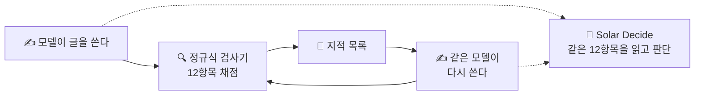

*이 블로그는 에이전트가 자료 대조와 실험을 거쳐 초안을 작성하고, 필자의 검수를 거쳐 게재됩니다.*

:::message
- AI가 쓴 일본어의 어색한 패턴을 잡는 yomiyasu로, 모델이 쓴 글 144편을 채점했습니다
- 검사 결과를 그대로 돌려주고 다시 쓰게 하자, **지적받은 패턴이 크게 줄었습니다**
- 정규식 검사기(yomiyasu)는 정해진 규칙을 확실히 잡고, 판단 모델(Solar Decide)은 규칙 밖의 표현까지 잡았습니다
:::

yomiyasu는 AI가 쓴 어색한 일본어를 사람이 읽기 쉬운 문장으로 고쳐 주는 Agent Skill입니다. 「静かに壊れる(조용히 망가진다)」 같은 비유나, 지나친 굵은 글씨·목록을 규칙으로 잡아내고, 함께 들어 있는 정규식 검사기로 점수도 매깁니다.

https://zenn.dev/algoartis/articles/0b1c731881b25c

https://github.com/nanaism/yomiyasu

이 규칙으로 모델이 쓴 일본어를 채점하고, 그 지적을 피드백으로 돌려줘 다시 쓰게 해 봤습니다.


---

## yomiyasu — 교정 매뉴얼과 정규식 검사기

yomiyasu는 두 부분으로 되어 있습니다. 하나는 AI가 읽고 글을 고치는 교정 매뉴얼(Agent Skill)로, 피해야 할 표현과 고치는 방법이 적혀 있습니다. 다른 하나는 정규식 검사기(`yomiyasu_lint.py`)로, AI를 쓰지 않고 정해진 패턴을 세어 100점에서 감점합니다.

이번 실험은 v1.0.6의 검사기를 그대로 썼습니다. 보는 항목은 비유 동사, 빈말 어휘, 상투적인 앞말·끝맺음, 같은 문말 3연속, 굵게 과다, 목록 과다, 이모지, 문장 끝 콜론, 불필요한 괄호, 영단어 앞뒤 공백, 깨진 굵게, 「AではなくB」의 12개입니다. 항목마다 5점씩 깎고, 「AではなくB」만 2점을 깎습니다.

## 두 모델에 72편씩 쓰게 하고, 두 가지로 채점했다

글감은 yomiyasu 리포에 있는 실무 글 프롬프트 24개입니다. 기술 해설, 장애 보고서, PR 설명, Slack 공지 같은 8종을 문체 3종으로 나눈 것입니다.

| 항목 | 내용 |
|---|---|
| 작가 | 업스테이지 [Solar Mini4](https://console.upstage.ai/docs/models/solar-mini-4), Claude Sonnet — 주제당 3편, 모델당 72편 |
| 평가 ① | 정규식 검사기 — yomiyasu 리포의 `yomiyasu_lint.py` 그대로 |
| 평가 ② | [Solar Decide](https://console.upstage.ai/docs/models/solar-decide) — 검사기의 12항목 설명을 질문으로 주고, 모델이 글을 읽고 판단 |
| 다시 쓰기 | 1차 평가 결과를 피드백으로 주고, yomiyasu 매뉴얼에 따라 각 모델이 자기 글을 다시 씀 |
| 2차 평가 | 1차와 같은 방식 |

Solar Decide는 [지난 편](https://zenn.dev/nhandsome/articles/decision-model-input-design)에서 치즈 미로 게임을 맡긴 판단 모델입니다. 이번에는 글을 판정하는 자리에 놓았습니다.



## 1차 채점 — 모델마다 걸리는 곳이 달랐다

| 작가 | 정규식 검사기 | Solar Decide |
|---|---|---|
| Solar Mini4 | 98.0 | 91.3 |
| Claude Sonnet | 94.8 | 81.8 |

점수보다 어디서 감점됐는지가 더 달랐습니다. Sonnet은 굵게·목록·이모지 같은 마크다운 서식에서, Mini4는 같은 문말이 세 번 이어지는 곳에서 주로 감점됐습니다. 「静かに壊れる」 같은 비유 표현은 두 모델 모두 거의 없었습니다.

같은 규칙으로 재도 **모델마다 버릇이 다르게 드러납니다.** 고칠 곳도 모델마다 달라질 것 같습니다. 모델별로 글을 쓰는 습관을 분석하는 데에도 쓸 수 있어 보입니다.

## 지적을 돌려주고 다시 쓰게 했다

정규식 검사기가 낸 지적을 그대로 피드백으로 주고, 각 모델에게 자기 글을 다시 쓰게 했습니다.

| 작가 | 정규식 검사기 | Solar Decide |
|---|---|---|
| Solar Mini4 | 98.0 → 99.2 | 91.3 → 91.5 |
| Claude Sonnet | 94.8 → 98.8 | 81.8 → 83.1 |

**지적받은 내용은 줄었고, 정규식 기준으로 나빠진 글은 0편이었습니다.** 걸린 글의 비율로 보면 이렇습니다.

- Sonnet 굵게 과다 31% → 0%
- Sonnet 목록 과다 36% → 12%
- Sonnet 같은 문말 3연속 18% → 3%
- Mini4 같은 문말 3연속 19% → 8%

고친 방식도 지적에 맞춰져 있었습니다.

### Sonnet 사양서 초안 — 목록을 지문으로

```text
（前）- 署名検証後、通知を永続化し、速やかにHTTP 2xxを応答する。
      - イベントIDによる冪等性を保証し、重複通知は二重処理しない。

（後）署名検証後、通知を永続化し、速やかにHTTP 2xxを応答する。イベントIDによる冪等性を保証し、重複通知は二重処理しない。
```

### Mini4 기술 해설 — 같은 문말 반복을 한 문장으로

```text
（前）キューの可用性も重視し、レプリカで冗長化する。キュー長、遅延、再試行回数、DLQ件数を可視化する。

（後）キューの可用性も重視し、レプリカで冗長化し、キュー長、遅延、再試行回数、DLQ件数を可視化する。
```

문장은 그대로 두고 목록 기호만 빼거나, 두 문장을 하나로 이었습니다. 지적이 없는 곳은 손대지 않았습니다. 글 길이 비율은 Sonnet 0.99, Mini4 1.00이었고, 60자 넘는 긴 문장도 늘지 않았습니다(Sonnet 11.8% → 11.0%, Mini4 12.4% → 12.2%).

한편 Solar Decide 점수는 거의 움직이지 않았습니다. 다시 쓸 때 준 피드백이 정규식 검사기의 지적뿐이었기 때문이라고 생각합니다.

## 정규식은 확실히, 판단 모델은 넓게

같은 12항목인데 두 평가의 점수가 꽤 다릅니다. 보는 방식이 다르기 때문입니다. 정규식 검사기는 정해진 패턴만 찾습니다. 잘못 거는 일이 없는 대신, 패턴에 없는 표현은 놓칩니다. Solar Decide는 항목 설명을 읽고 뜻으로 판단하기 때문에, 목록에 없는 표현도 "같은 종류"면 잡습니다.

Solar Decide는 잡고 정규식 검사기는 놓친 예를 두 개 보겠습니다. 둘 다 Sonnet이 쓴 기술 해설입니다.

### ① 목록에 없는 비유 동사

```text
下流が一つ落ちただけで呼び出し元までスレッドを食われて連鎖障害になる。
これを何度か本番で踏んだ結果、…設計に寄せている。
キューが効くのは時間的な疎結合ができるからだ。
```

「スレッドを食われて(스레드를 먹혀서)」「本番で踏んだ(운영 환경에서 밟았다)」「設計に寄せている(설계 쪽으로 붙이고 있다)」, 수식어 없는 「効く(듣는다)」. 검사기는 「地味に効く」처럼 목록에 적힌 형태만 찾기 때문에 0건이었습니다. Solar Decide는 "도구나 현상을 몸의 동작으로 나타낸 비유"라는 뜻으로 보고 잡았습니다.

### ② です・ます가 아닌 문말의 반복

```text
…コンシューマを冪等に実装する。
…再実行しても結果が変わらない操作にする。
…デッドレターキュー（DLQ）を用意する。
```

검사기의 문말 반복 규칙은 「ます」「です」 같은 정해진 문말만 셉니다. 「〜する。」가 세 번 이어지는 것은 세지 않습니다. Solar Decide는 "같은 문말이 3번 이어진다"는 항목 설명대로, 형태와 관계없이 잡았습니다.

**정해진 문자열이 아니라 항목의 뜻으로 판단하기 때문에, 규칙을 넓혀서 적용합니다.** 같은 이유로 너무 넓게 거는 경우도 있습니다. 수치를 보충하는 「（最大100本）」를 불필요한 괄호로 본 것이 그런 예입니다. 그래서 같은 글이라도 점수가 크게 갈리기도 했습니다. Mini4의 Slack 공지 한 편은 정규식 95점, Solar Decide 55점이었습니다.

## 형식이 정해진 글을 일정하게 지키는 데

yomiyasu는 생성된 글의 질을 다루는 좋은 방법으로 보입니다. 정규식 규칙은 유연하지 않지만, **정해진 규칙은 확실히 잡습니다.** 이번에도 잘못 거는 일 없이 지적을 냈고, 그대로 고치자 점수가 올랐습니다. 글의 품질을 일정하게 유지하는 데 쓸 만합니다. 패턴 밖의 표현처럼 유연함이 필요한 부분은 판단 모델로 보완할 수 있을 것 같습니다.

이런 성질은 형식이 정해진 글에 잘 맞습니다. 이 블로그도 yomiyasu의 정규식 규칙을 블로그용으로 고쳐 스킬로 넣었습니다. 여기에 **지금까지 블로그를 쓰면서 지적받아 온 패턴 중 정규식으로 잡을 수 있는 것**을 규칙으로 더했습니다. 일본어의 「問う」 같은 딱딱한 동사나, 한국어의 「여기서부터가 본론입니다」 같은 메타 문장이 그 예입니다. 글을 더 많이 쓸수록 규칙이 쌓이고, 이 블로그의 글쓰기 패턴과 질도 한곳으로 모여 가지 않을까 기대하고 있습니다.

:::message alert
**이 실험의 한계**

- 평가는 "AI 티가 나는 패턴이 얼마나 없는가"라는 겉모습 기준입니다. 글 전체의 자연스러움은 재지 않았습니다
- 모델의 우열을 가리는 실험이 아닙니다. 주제·문체·편수를 맞춘 단순 비교입니다
:::

---

> 피해야 할 표현을 규칙으로 적어 두고 그 지적을 돌려주자, 글이 실제로 고쳐졌습니다. 규칙은 좁지만 확실하고, 규칙 밖은 판단 모델이 넓게 봅니다. **지적받을 때마다 규칙을 하나씩 더해 가면, 이 블로그의 글도 조금씩 한 방향으로 모여 가지 않을까 기대합니다.**

필자는 Upstage AI에서 TPM/SA를 맡고 있는 엔지니어입니다. 업스테이지는 Document AI·LLM·Agent를 조합해 문서의 정형화와 그 활용, 실제 업무로의 적용을 지원합니다. 관심 있으시면 [홈페이지](https://www.upstage.ai/jp)로 연락 주세요.
