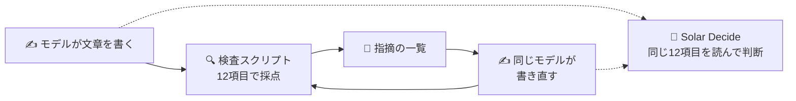

*このブログは、エージェントが資料の突き合わせと実験を行って下書きを作り、筆者が確認したうえで掲載しています。*

:::message
- AIが書いた日本語のぎこちないパターンを見つける yomiyasu で、モデルが書いた144本の文章を採点しました
- 検査結果をそのまま返して書き直させると、**指摘されたパターンが大きく減りました**
- 検査スクリプト（yomiyasu）は決められたルールを確実に拾い、判断モデル（Solar Decide）はルールの外にある表現まで拾いました
:::

yomiyasu は、AIが書いた不自然な日本語を、人が読みやすい文章に直すための Agent Skill です。「静かに壊れる」のような比喩や、太字・箇条書きの使いすぎをルールとして洗い出し、付属の検査スクリプトで点数もつけてくれます。

https://zenn.dev/algoartis/articles/0b1c731881b25c

https://github.com/nanaism/yomiyasu

このルールでモデルが書いた日本語を採点し、その指摘をフィードバックとして返して書き直させてみました。


---

## yomiyasu：直し方の手引きと検査スクリプト

yomiyasu の中身は二つです。一つは、AIが読んで文章を直すための手引き（Agent Skill）で、避けたい表現とその直し方が書かれています。もう一つは正規表現を使った検査スクリプト（`yomiyasu_lint.py`）で、AIは使わず、決められたパターンを数えて100点から減点します。

今回の実験では v1.0.6 の検査スクリプトをそのまま使いました。見る項目は、比喩動詞、中身のない語、決まり文句の前置き・締め、同じ文末の3回連続、太字の多用、箇条書きの多用、絵文字、文末のコロン、不要なカッコ、英単語の前後の半角スペース、表示されない太字、「AではなくB」の12個です。1項目につき5点、「AではなくB」だけは2点を引きます。

## 2つのモデルに72本ずつ書かせ、2通りの方法で採点した

題材は yomiyasu のリポジトリにある実務文書のプロンプト24個です。技術解説、障害報告書、PR の説明文、Slack のお知らせなど8種類を、それぞれ3通りの文体で書かせました。

| 項目 | 内容 |
|---|---|
| 書き手 | Upstage の [Solar Mini4](https://console.upstage.ai/docs/models/solar-mini-4)、Claude Sonnet。1つの題材につき3本、モデルごとに72本 |
| 評価① | 検査スクリプト。yomiyasu リポジトリの `yomiyasu_lint.py` をそのまま使用 |
| 評価② | [Solar Decide](https://console.upstage.ai/docs/models/solar-decide)。検査スクリプトの12項目の説明を質問として渡し、モデルが文章を読んで判断 |
| 書き直し | 1回目の評価結果をフィードバックとして渡し、yomiyasu の手引きに沿って各モデルが自分の文章を書き直す |
| 2回目の評価 | 1回目と同じ方法 |

Solar Decide は、[前回の記事](https://zenn.dev/nhandsome/articles/decision-model-input-design)でチーズ迷路ゲームを任せた判断モデルです。今回は文章を判定する役に置きました。



## 1回目の採点：モデルによって引っかかる場所が違った

| 書き手 | 検査スクリプト | Solar Decide |
|---|---|---|
| Solar Mini4 | 98.0 | 91.3 |
| Claude Sonnet | 94.8 | 81.8 |

点数そのものより、どこで減点されたかの違いが目立ちました。Sonnet は太字・箇条書き・絵文字といったマークダウンの書式で、Mini4 は同じ文末が3回続く箇所で、主に減点されています。「静かに壊れる」のような比喩表現は、どちらのモデルにもほとんどありませんでした。

同じルールで測っても、**モデルごとのくせが違う形で表れます。** 直すべき場所も、モデルによって変わってきそうです。モデルごとの書きぐせを分析する道具としても使えるかもしれません。

## 指摘を返して、書き直させた

検査スクリプトの指摘をそのままフィードバックとして渡し、各モデルに自分の文章を書き直させました。

| 書き手 | 検査スクリプト | Solar Decide |
|---|---|---|
| Solar Mini4 | 98.0 → 99.2 | 91.3 → 91.5 |
| Claude Sonnet | 94.8 → 98.8 | 81.8 → 83.1 |

**指摘された内容は減り、検査スクリプトの基準で悪くなった文章は0本でした。** 引っかかった文章の割合で見ると、次のとおりです。

- Sonnet の太字の多用：31% → 0%
- Sonnet の箇条書きの多用：36% → 12%
- Sonnet の同じ文末の3回連続：18% → 3%
- Mini4 の同じ文末の3回連続：19% → 8%

直し方も、指摘に合わせたものになっていました。

### Sonnet の仕様書ドラフト：箇条書きを地の文に

```text
（前）- 署名検証後、通知を永続化し、速やかにHTTP 2xxを応答する。
      - イベントIDによる冪等性を保証し、重複通知は二重処理しない。

（後）署名検証後、通知を永続化し、速やかにHTTP 2xxを応答する。イベントIDによる冪等性を保証し、重複通知は二重処理しない。
```

### Mini4 の技術解説：同じ文末の繰り返しを一文にまとめる

```text
（前）キューの可用性も重視し、レプリカで冗長化する。キュー長、遅延、再試行回数、DLQ件数を可視化する。

（後）キューの可用性も重視し、レプリカで冗長化し、キュー長、遅延、再試行回数、DLQ件数を可視化する。
```

文の中身はそのままに、箇条書きの記号を外したり、二つの文を一つにつないだりしています。指摘のない箇所には手を入れていません。文章の長さの比は Sonnet が0.99、Mini4 が1.00で、60字を超える長い文も増えませんでした（Sonnet 11.8% → 11.0%、Mini4 12.4% → 12.2%）。

一方で、Solar Decide の点数はほとんど動いていません。書き直しのときに渡したフィードバックが、検査スクリプトの指摘だけだったからだと考えています。

## 正規表現は確実に、判断モデルは広く

同じ12項目なのに、二つの評価の点数はかなり違います。見方が違うからです。検査スクリプトが探すのは決められたパターンだけなので、間違って引っかけることはない一方、パターンにない表現は見逃します。Solar Decide は項目の説明を読んで意味で判断するので、リストにない表現でも「同じ種類」であれば拾えるのが特徴です。

Solar Decide は拾い、検査スクリプトは見逃した例を二つ挙げます。どちらも Sonnet が書いた技術解説です。

### ① リストにない比喩動詞

```text
下流が一つ落ちただけで呼び出し元までスレッドを食われて連鎖障害になる。
これを何度か本番で踏んだ結果、…設計に寄せている。
キューが効くのは時間的な疎結合ができるからだ。
```

「スレッドを食われて」「本番で踏んだ」「設計に寄せている」、それに修飾語のつかない「効く」。検査スクリプトは「地味に効く」のように、リストに書かれた形しか探さないため、0件でした。Solar Decide は「道具や現象を体の動きで表した比喩」という意味で捉えて拾っています。

### ② です・ます以外の文末の繰り返し

```text
…コンシューマを冪等に実装する。
…再実行しても結果が変わらない操作にする。
…デッドレターキュー（DLQ）を用意する。
```

検査スクリプトの文末ルールが数えるのは、「ます」「です」のように決められた文末です。「〜する。」が3回続いても数えません。Solar Decide は「同じ文末が3回続く」という項目の説明どおりに、形に関係なく拾いました。

**決められた文字列ではなく項目の意味で判断するため、ルールを広げて当てはめます。** 同じ理由で、広げすぎることもあります。数値を補う「（最大100本）」を不要なカッコと判定したのがその例です。そのため、同じ文章でも点数が大きく分かれることがありました。Mini4 の Slack のお知らせ1本は、検査スクリプトで95点、Solar Decide で55点でした。

## 書式の決まった文章の質をそろえる

yomiyasu は、生成した文章の質を扱うよい方法だと思います。正規表現のルールは融通がききませんが、**決められたルールは確実に拾います。** 今回も誤った指摘はなく、その指摘どおりに直すと点数が上がりました。文章の質を一定に保つ用途には十分使えそうです。パターンの外にある表現のように柔軟さが要る部分は、判断モデルで補えるのではないかと思います。

こうした性質は、書式の決まった文章によく合います。このブログでも、yomiyasu の正規表現ルールをブログ向けに手直ししてスキルとして組み込みました。そこに、**これまでブログを書くなかで指摘されてきたパターンのうち、正規表現で拾えるもの**をルールとして足しています。日本語版の「問う」のような硬い動詞や、韓国語版の「ここからが本題です」のようなメタな一文がその例です。記事を書くほどルールがたまり、このブログの書き方や質も一つの方向にそろっていくのではないかと期待しています。

:::message alert
**この実験の限界**

- 評価は「AIっぽいパターンがどれだけ少ないか」という見た目の基準です。文章全体の自然さは測っていません
- モデルの優劣を決める実験ではありません。題材・文体・本数をそろえた単純な比較です
:::

---

> 避けたい表現をルールとして書き出し、その指摘を返すと、文章は実際に直りました。ルールは狭くても確実で、ルールの外は判断モデルが広く見てくれます。**指摘を受けるたびにルールを一つずつ足していけば、このブログの文章も少しずつ一つの方向にそろっていくのではないかと期待しています。**

筆者は Upstage AI で TPM/SA を担当しているエンジニアです。Upstage は Document AI・LLM・Agent を組み合わせ、文書の構造化とその活用、実業務への適用を支援しています。ご興味がありましたら、[ホームページ](https://www.upstage.ai/jp)からお問い合わせください。
